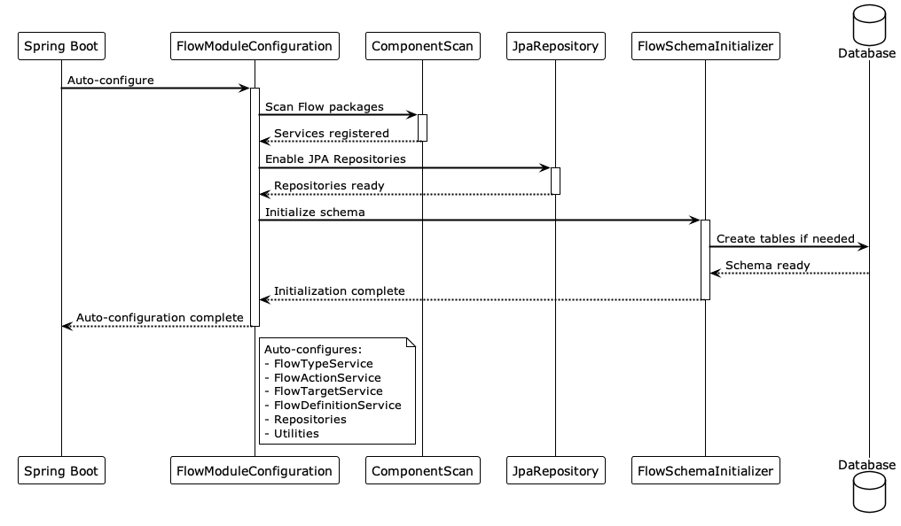

# Architecture

## Auto-Configuration Sequence

## Flow Component Sequence

The following diagram shows the sequence of creating and using Flow components:

## System Components

| Component | Purpose |
|-----------|---------|
| `FlowTypeService` | Manages flow type entities - categories for organizing flows |
| `FlowActionService` | Manages flow action entities - defines actions with input/output schemas |
| `FlowTargetService` | Manages flow target entities - defines targets with credential schemas |
| `FlowDefinitionService` | Manages flow definition entities - combines actions and targets with code |
| `FlowModuleConfiguration` | Auto-configuration class - sets up all components when library is on classpath |
| `FlowSchemaInitializer` | Initializes database schema on application startup |
| `FlowJsonSchemaAndPayloadValidator` | Validates JSON payloads against JSON schemas |

