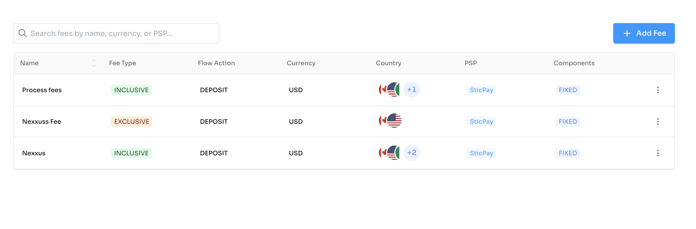
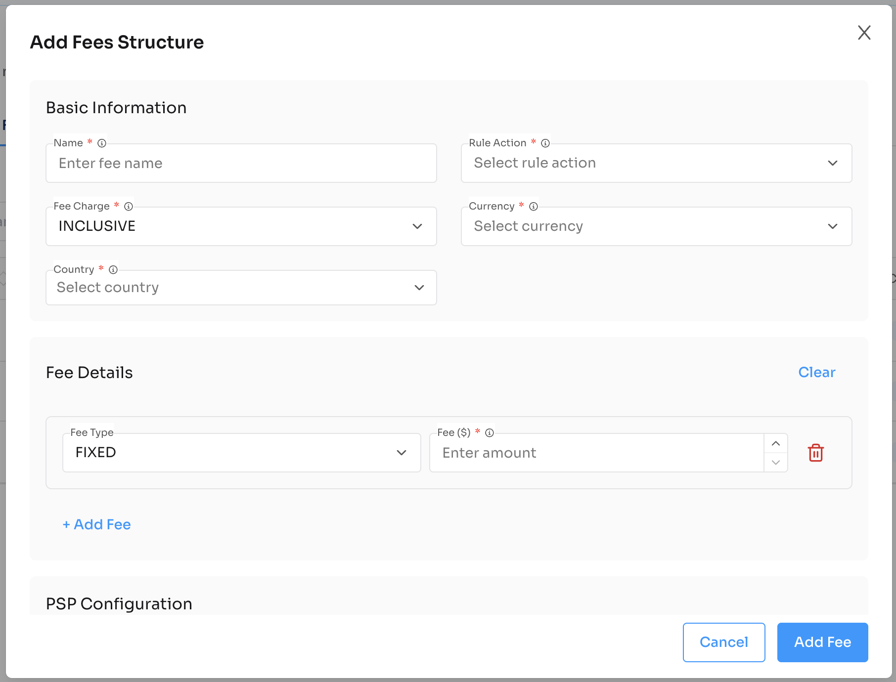

# Fee Rule Component

Plug-and-play React component to manage fee rules and pricing for PSPs using Nexxus APIs.

---

## Installation

```bash
npm install @nexxus/fee-rule
```

---

## Basic Usage

```tsx
import { FeeRule } from "@nexxus/fee-rule";

<FeeRule
  domain="https://crm-api.io"
  header={{ BRAND: "<your-id>" }}
/>;
```

---

## Component Props

| Prop | Type | Required | Description |
| --- | --- | --- | --- |
| `domain` | `string` | Yes | Base API domain (e.g., `https://crm-api.io`). |
| `header` | `object` | No | Optional headers such as `BRAND` or auth tokens. |

---

## Full Example

```tsx
import { NexxusProvider, nexxusThemeSystem } from "@nexxus/react";
import { FeeRule } from "@nexxus/fee-rule";

export default function FeeRulePage() {
  return (
    <NexxusProvider value={nexxusThemeSystem}>
      <FeeRule
        domain="https://crm-api.io"
        header={{ BRAND: "your-brand-id" }}
      />
    </NexxusProvider>
  );
}
```

---

## API Integration Flow (handled internally)

The FeeRule component orchestrates these API calls:

### Get Fees

`GET /api/v1/fees`

Retrieves all fee rules.

```json
{
  "data": [
    {
      "id": "fee_001",
      "name": "Standard Processing Fee",
      "currency": "USD",
      "chargeFeeType": "INCLUSIVE",
      "flowActionName": "DEPOSIT",
      "components": [
        { "type": "FIXED", "amount": 0.30 },
        { "type": "PERCENTAGE", "amount": 2.9 }
      ],
      "psps": [
        { "id": "psp_XM4A6OR9UGyikYRfKczNs0DzQd", "name": "BridgerPay" }
      ],
      "createdAt": "2025-01-15T10:30:00",
      "updatedAt": "2025-01-15T10:30:00"
    }
  ]
}
```

### Get Fees by PSP

`GET /api/v1/fees/psp/{pspId}`

Retrieves fee rules for a specific PSP.

```json
{
  "data": [
    {
      "name": "Process fees",
      "currency": "USD",
      "chargeFeeType": "INCLUSIVE",
      "components": [{ "type": "FIXED", "amount": 10 }],
      "psps": [{ "id": "psp_5SYGziwRArbxGDeRpWKgHVd6HE", "name": "SticPay" }]
    }
  ]
}
```

### Create Fee Rule

`POST /api/v1/fees`

Creates a new fee rule.

**Request Body:**

```json
{
  "name": "Premium Processing Fee",
  "currency": "USD",
  "chargeFeeType": "EXCLUSIVE",
  "flowActionName": "DEPOSIT",
  "components": [
    { "type": "FIXED", "amount": 0.50 },
    { "type": "PERCENTAGE", "amount": 1.5 }
  ],
  "pspIds": ["psp_XM4A6OR9UGyikYRfKczNs0DzQd"]
}
```

**Response:**

```json
{
  "data": {
    "id": "fee_002",
    "name": "Premium Processing Fee",
    "currency": "USD",
    "chargeFeeType": "EXCLUSIVE",
    "flowActionName": "DEPOSIT",
    "components": [
      { "type": "FIXED", "amount": 0.50 },
      { "type": "PERCENTAGE", "amount": 1.5 }
    ],
    "psps": [{ "id": "psp_XM4A6OR9UGyikYRfKczNs0DzQd", "name": "BridgerPay" }],
    "createdAt": "2025-01-15T10:30:00",
    "updatedAt": "2025-01-15T10:30:00"
  }
}
```

### Update Fee Rule

`PUT /api/v1/fees/{id}`

Updates an existing fee rule.

### Delete Fee Rule

`DELETE /api/v1/fees/{id}`

Deletes a fee rule.

---

## Fee Rule Object

| Field | Type | Description |
| --- | --- | --- |
| `id` | `string` | Unique identifier |
| `name` | `string` | Rule name |
| `currency` | `string` | Currency code (e.g., USD, EUR) |
| `chargeFeeType` | `string` | Fee charge type: `INCLUSIVE`, `EXCLUSIVE` |
| `flowActionName` | `string` | Transaction action: `DEPOSIT`, `WITHDRAW` |
| `components` | `array` | Fee components |
| `components[].type` | `string` | Component type: `FIXED`, `PERCENTAGE` |
| `components[].amount` | `number` | Fee amount |
| `psps` | `array` | Associated PSPs |
| `createdAt` | `string` | Creation timestamp |
| `updatedAt` | `string` | Last update timestamp |

---

## Fee Types

### INCLUSIVE

Fee is included in the transaction amount. The customer sees the total amount including fees.

```
Transaction: $100
Fee (2.9% + $0.30): $3.20
Customer pays: $100
Merchant receives: $96.80
```

### EXCLUSIVE

Fee is added on top of the transaction amount. The customer pays extra for fees.

```
Transaction: $100
Fee (2.9% + $0.30): $3.20
Customer pays: $103.20
Merchant receives: $100
```

---

## Fee Components

### FIXED

A fixed amount charged per transaction.

```json
{
  "type": "FIXED",
  "amount": 0.30
}
```

### PERCENTAGE

A percentage of the transaction amount.

```json
{
  "type": "PERCENTAGE",
  "amount": 2.9
}
```

---

## Fee Calculation Example

For a $100 transaction with the following components:
- Fixed: $0.30
- Percentage: 2.9%

```
Fixed Fee: $0.30
Percentage Fee: $100 × 2.9% = $2.90
Total Fee: $0.30 + $2.90 = $3.20
```

---

## UI Preview



