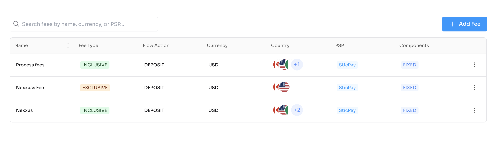
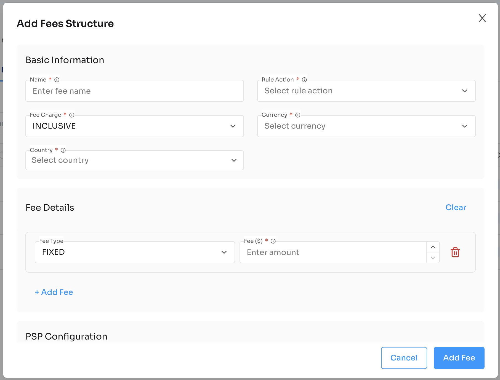

# Fee Component

Plug-and-play React component to manage fee rules and pricing for PSPs using Nexxus APIs.

---

## Installation

```bash
npm install @nexxus/fees-component
```

---

## Basic Usage

```tsx
import FeeComponent from "@nexxus/fees-component";

<FeeComponent
  baseURL="https://api.example.com/nexxus/v1"
  brand="your-brand-id"
  environment="your-env-id"
  flowTypeId="ftp_001"
/>
```

---

## Component Props

| Prop | Type | Required | Description |
| --- | --- | --- | --- |
| `client` | `QueryClient` | No | Custom TanStack Query client. Uses internal client if omitted. |
| `domain` | `string` | No | Base API domain. Alias for `baseURL`. |
| `baseURL` | `string` | No | API base URL (e.g., `https://api.example.com/nexxus/v1`). |
| `secretToken` | `string` | No | API authentication token. Sent as `X-SECRET-TOKEN` header. |
| `header` | `Record<string, string>` | No | Custom headers (e.g., `{ 'X-BRAND-ID': '...' }`). |
| `brand` | `string` | No | Brand identifier. Alias for `brandId`. |
| `brandId` | `string` | No | Brand ID for API scoping. |
| `environment` | `string` | No | Environment identifier. Alias for `environmentId`. |
| `environmentId` | `string` | No | Environment ID for API scoping. |
| `flowTypeId` | `string` | No | Flow type ID to scope fee rules. |

---

## Full Example

```tsx
import { NexxusProvider, nexxusThemeSystem } from "@nexxus/react";
import FeeComponent from "@nexxus/fees-component";

export default function FeeRulePage() {
  return (
    <NexxusProvider value={nexxusThemeSystem}>
      <FeeComponent
        baseURL="https://api.example.com/nexxus/v1"
        brand="your-brand-id"
        environment="your-env-id"
        flowTypeId="ftp_001"
      />
    </NexxusProvider>
  );
}
```

---

## Sub-Components

The package also exports individual building blocks:

| Component | Description |
| --- | --- |
| `FeeList` | Table view of fees with search, create/edit/delete actions |
| `FeeForm` | Form for creating or editing a fee rule |
| `FeeModal` | Modal wrapper around `FeeForm` |
| `CreateFeeModal` | Pre-configured modal for creating a fee |
| `EditFeeModal` | Pre-configured modal for editing a fee |
| `createFeeTableColumns` | Factory for table column definitions |

---

## Form Fields

### Basic Information

| Field | Type | Component | Validation |
| --- | --- | --- | --- |
| `name` | `string` | Input | Required, max 100 chars |
| `flowActionId` | `string` | Select | Required. Options from Flow Action API. |
| `chargeFeeType` | `'INCLUSIVE' \| 'EXCLUSIVE'` | Select | Required |
| `currency` | `string` | Select | Required. Options from Currencies API. |
| `countries` | `string[]` | MultiSelect | 1-50 items. Options from Countries API. |

### Fee Details (dynamic rows, 1-10)

| Field | Type | Component | Validation |
| --- | --- | --- | --- |
| `components[].type` | `'FIXED' \| 'PERCENTAGE'` | Select | Required. Max one of each type. |
| `components[].amount` | `number` | NumberInput | Required. FIXED: 0-999,999,999. PERCENTAGE: 0-100. |
| `components[].minValue` | `number` | NumberInput | PERCENTAGE only. Optional. 0-999,999,999. |
| `components[].maxValue` | `number` | NumberInput | PERCENTAGE only. Optional. Must be > minValue. |

### PSP Configuration

| Field | Type | Component | Validation |
| --- | --- | --- | --- |
| `psps` | `string[]` | MultiSelect | 1-20 items. Depends on selected action + currency. |

---

## Fee Types

### INCLUSIVE

Fee is included in the transaction amount. The customer sees the total amount including fees.

```
Transaction: $100
Fee (2.9% + $0.30): $3.20
Customer pays: $100
Merchant receives: $96.80
```

### EXCLUSIVE

Fee is added on top of the transaction amount. The customer pays extra for fees.

```
Transaction: $100
Fee (2.9% + $0.30): $3.20
Customer pays: $103.20
Merchant receives: $100
```

---

## Fee Components

### FIXED

A fixed amount charged per transaction.

```json
{ "type": "FIXED", "amount": 0.30 }
```

### PERCENTAGE

A percentage of the transaction amount, with optional min/max caps.

```json
{
  "type": "PERCENTAGE",
  "amount": 2.9,
  "minValue": 1.00,
  "maxValue": 50.00
}
```

---

## API Integration (handled internally)

| Method | Endpoint | Description |
| --- | --- | --- |
| `getFees` | `GET /fees` | List all fee rules |
| `getFeeById` | `GET /fees/{id}` | Get fee by ID (for edit) |
| `createFee` | `POST /fees` | Create a new fee rule |
| `updateFee` | `PUT /fees/{id}` | Update an existing fee rule |
| `deleteFee` | `DELETE /fees/{id}` | Delete a fee rule |
| `getFlowActions` | `GET /flow-types/{flowTypeId}/flow-actions` | Load flow actions for the select |
| `getCurrencies` | `GET /psps/currencies` | Load available currencies |
| `getCountries` | `GET /psps/countries` | Load available countries |
| `getPSPsByActionAndCurrency` | `GET /psps/{actionId}/ENABLED/{currency}` | Load PSPs filtered by action + currency |

### Example API Payloads

**Create Fee Request:**

```json
{
  "name": "Premium Processing Fee",
  "currency": "USD",
  "chargeFeeType": "EXCLUSIVE",
  "flowActionId": "fa_deposit_001",
  "status": "ENABLED",
  "components": [
    { "type": "FIXED", "amount": 0.50 },
    { "type": "PERCENTAGE", "amount": 1.5, "minValue": 1.00, "maxValue": 50.00 }
  ],
  "countries": ["US", "CA"],
  "psps": [{ "id": "psp_XM4A6OR9UGyikYRfKczNs0DzQd" }]
}
```

**Fee Response:**

```json
{
  "data": {
    "id": "fee_002",
    "name": "Premium Processing Fee",
    "currency": "USD",
    "chargeFeeType": "EXCLUSIVE",
    "status": "ENABLED",
    "components": [
      { "type": "FIXED", "amount": 0.50 },
      { "type": "PERCENTAGE", "amount": 1.5, "minValue": 1.00, "maxValue": 50.00 }
    ],
    "countries": ["US", "CA"],
    "psps": [{ "id": "psp_XM4A6OR9UGyikYRfKczNs0DzQd", "name": "BridgerPay" }],
    "createdAt": "2025-01-15T10:30:00",
    "updatedAt": "2025-01-15T10:30:00"
  }
}
```

---

## Fee Rule Object

| Field | Type | Description |
| --- | --- | --- |
| `id` | `string` | Unique identifier |
| `name` | `string` | Rule name |
| `currency` | `string` | Currency code (e.g., USD, EUR) |
| `chargeFeeType` | `'INCLUSIVE' \| 'EXCLUSIVE'` | Fee charge type |
| `status` | `'ENABLED' \| 'DISABLED'` | Rule status |
| `flowActionId` | `string` | Associated flow action |
| `components` | `FeeComponent[]` | Fee components (FIXED / PERCENTAGE) |
| `components[].type` | `'FIXED' \| 'PERCENTAGE'` | Component type |
| `components[].amount` | `number` | Fee amount |
| `components[].minValue` | `number?` | Min fee cap (PERCENTAGE only) |
| `components[].maxValue` | `number?` | Max fee cap (PERCENTAGE only) |
| `countries` | `string[]` | Applicable countries |
| `psps` | `{ id, name }[]` | Associated PSPs |
| `createdAt` | `string` | Creation timestamp |
| `updatedAt` | `string` | Last update timestamp |

---

## i18n

The fee component registers translations under the `fees` namespace. Supported languages: `en`, `es`, `ar`.

Key sections: `fees.list.*`, `fees.form.*`, `fees.modals.*`, `fees.validation.*`, `fees.messages.*`.

---

## UI Preview



