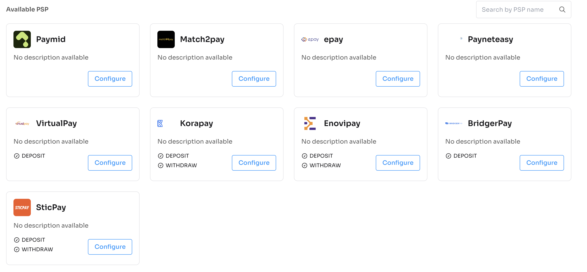
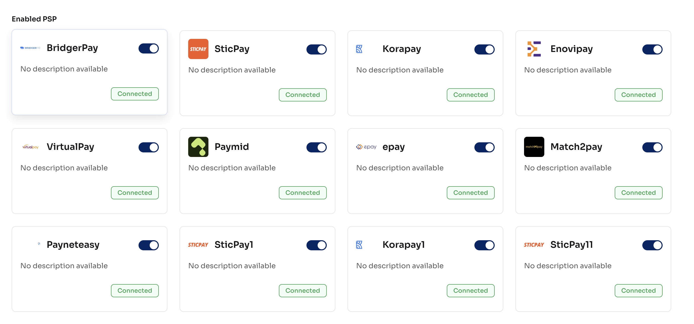
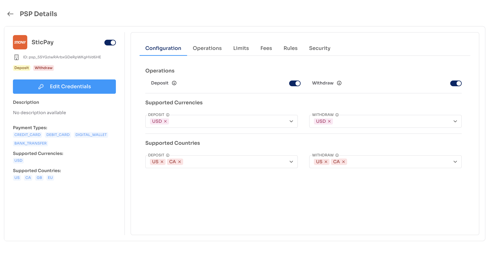

# Nexxus PSP Components

Plug-and-play React components to list, select, and configure PSPs (Payment Service Providers) using Nexxus APIs.

---

## Package List

```bash
npm install @nexxus/react            # Theme provider
npm install @nexxus/psp             # PSP listing & selection (with API integration)
npm install @nexxus/psp-details     # PSP detail screens
npm install @nexxus/transaction-rule
npm install @nexxus/routing-rule
npm install @nexxus/risk-rule
npm install @nexxus/fee-rule
```

## Installation

```bash
npm install @nexxus/react @nexxus/psp @nexxus/psp-details
```

## Global Theme Setup (required)

Wrap your application with the Nexxus provider for consistent theming:

```tsx
import { NexxusProvider, nexxusThemeSystem } from "@nexxus/react";

<NexxusProvider value={nexxusThemeSystem}>
  {/* your app */}
</NexxusProvider>
```

---

## PSP Component Usage

```tsx
import { PSP } from "@nexxus/psp";

<PSP
  domain="https://crm-api.io"
  header={{ BRAND: "<your-id>" }}
  onPspCardClick={(pspData) => {
    console.log("Selected PSP:", pspData);
  }}
/>;
```

### Component Props

| Prop | Type | Required | Description |
| --- | --- | --- | --- |
| `domain` | `string` | Yes | Base API domain (e.g., `https://crm-api.io`). |
| `header` | `object` | No | Optional headers such as `BRAND` or auth tokens. |
| `onPspCardClick` | `(psp) => void` | Yes | Fired when a PSP card is clicked; receives PSP data. |

### `onPspCardClick` payload

```json
{
  "id": "psp_XM4A6OR9UGyikYRfKczNs0DzQd",
  "name": "BridgerPay",
  "description": null,
  "logo": "https://cdn.brandfetch.io/idqRBSVze5/theme/dark/logo.svg",
  "status": "ENABLED",
  "brandId": "brn_001",
  "environmentId": "env_uat_001",
  "flowTargetId": "ftg_bridgerpay_001",
  "createdAt": "2025-11-17T14:49:35",
  "updatedAt": "2025-11-17T14:49:35",
  "createdBy": "usr_fi_001",
  "updatedBy": "usr_fi_001",
  "riskRules": null,
  "feeRules": null,
  "transactionLimits": null
}
```

---

## API Integration Flow (handled internally)

The PSP component orchestrates these API calls in sequence:

### 1) Get Flow Types

`GET /api/v1/flow-types`

Used to fetch available transaction flow types (e.g., PSP flows) and pick the relevant flow type id.

```json
[
  {
    "id": "ftp_psp_001",
    "name": "PSP - update"
  }
]
```

### 2) Get PSPs

`GET /api/v1/psps`

Retrieves enabled PSPs to render as selectable cards.

```json
[
  {
    "id": "psp_XM4A6OR9UGyikYRfKczNs0DzQd",
    "name": "BridgerPay",
    "logo": "https://cdn.brandfetch.io/idqRBSVze5/theme/dark/logo.svg",
    "status": "ENABLED",
    "flowTargetId": "ftg_bridgerpay_001"
  }
]
```

### 3) Get Flow Targets by Flow Type

`GET /api/v1/flow-types/{flowTypeId}/flow-targets`

Provides PSP configuration metadata: supported actions, credential schema, currencies, countries, and payment methods.

```json
{
  "id": "ftg_ZMkOAGcA84x61ufgmV2yNNxqgj",
  "name": "VirtualPay",
  "credentialSchema": { "required": ["mid", "apiKey", "privateKey"] },
  "supportedActions": [{ "flowActionName": "DEPOSIT" }],
  "currencies": ["USD"],
  "countries": ["US", "CA", "GB"],
  "paymentMethods": ["credit_card", "debit_card", "digital_wallet"]
}
```

---

## Full Example

```tsx
import { NexxusProvider, nexxusThemeSystem } from "@nexxus/react";
import { PSP } from "@nexxus/psp";

export default function App() {
  return (
    <NexxusProvider value={nexxusThemeSystem}>
      <PSP
        domain="https://crm-api.io"
        header={{ BRAND: "your-brand-id" }}
        onPspCardClick={(psp) => {
          console.log("Selected PSP:", psp);
        }}
      />
    </NexxusProvider>
  );
}
```

---

## UI Preview

Available PSPs list:



Enabled PSPs list:



---

## Nexxus PSP Details Component

Use `@nexxus/psp-details` to view a single PSP and navigate to limits, fees, or risk rule pages.

### Install

```bash
npm install @nexxus/psp-details
```

### Basic Usage

```tsx
import { NexxusProvider, nexxusThemeSystem } from "@nexxus/react";
import { PSPDetails } from "@nexxus/psp-details";

function PspDetailsPage() {
  return (
    <NexxusProvider value={nexxusThemeSystem}>
      <PSPDetails
        domain="https://crm-api.io"
        header={{ BRAND: "your-brand-id" }}
        redirectUrl={{
          limits: "/limits",
          fees: "/fees",
          risk: "/risk"
        }}
      />
    </NexxusProvider>
  );
}
```

### Props

| Prop | Type | Required | Description |
| --- | --- | --- | --- |
| `domain` | `string` | Yes | Base API domain (e.g., `https://crm-api.io`). |
| `header` | `object` | No | Optional headers such as `BRAND` or auth tokens. |
| `redirectUrl` | `object` | No | Destinations for CTA buttons: `{ limits, fees, risk }`. |

---

## API References (used by PSP Details)

### Get PSP By Id
`GET /api/v1/psps/{pspId}`

Returns PSP metadata, credential schema, supported actions, and flow target info.

```json
{
  "data": {
    "id": "psp_XM4A6OR9UGyikYRfKczNs0DzQd",
    "name": "BridgerPay",
    "logo": "https://cdn.brandfetch.io/idqRBSVze5/theme/dark/logo.svg",
    "status": "ENABLED",
    "flowTarget": {
      "currencies": ["USD", "EUR", "GBP"],
      "countries": ["US", "CA", "GB", "EU"],
      "paymentMethods": ["credit_card", "debit_card", "digital_wallet"],
      "supportedActions": [{ "flowActionName": "DEPOSIT" }]
    }
  }
}
```

### Get Transaction Limits
`GET /api/v1/transaction-limits/psp/{pspId}`

```json
{
  "data": [
    {
      "name": "Nexxuss",
      "currency": "KES",
      "pspActions": [
        { "flowActionName": "DEPOSIT", "minAmount": 10, "maxAmount": 100 },
        { "flowActionName": "WITHDRAW", "minAmount": 10, "maxAmount": 1000 }
      ],
      "psps": [{ "id": "psp_XM4A6OR9UGyikYRfKczNs0DzQd", "name": "BridgerPay" }]
    }
  ]
}
```

### Get Fees
`GET /api/v1/fees/psp/{pspId}`

```json
{
  "data": [
    {
      "name": "Process fees",
      "currency": "USD",
      "chargeFeeType": "INCLUSIVE",
      "components": [{ "type": "FIXED", "amount": 10 }],
      "psps": [{ "id": "psp_5SYGziwRArbxGDeRpWKgHVd6HE", "name": "SticPay" }]
    }
  ]
}
```

### Get Risk Rules
`GET /api/v1/risk-rules/psp/{pspId}`

```json
{
  "data": [
    {
      "name": "Nexxus",
      "type": "CUSTOMER",
      "action": "BLOCK",
      "criteriaType": "TAG",
      "criteriaValue": ["VIP"],
      "flowActionName": "DEPOSIT",
      "psps": [{ "id": "psp_5SYGziwRArbxGDeRpWKgHVd6HE", "name": "SticPay" }]
    }
  ]
}
```

## UI Preview

Available PSPs list:

