# Nexxus PSP Components

Plug-and-play React components to list, configure, and manage PSPs (Payment Service Providers) using Nexxus APIs.

## Package List

```bash
npm install @nexxus/react                # Theme provider & i18n
npm install @nexxus/psp                  # PSP listing, configuration & details
npm install @nexxus/fees-component       # Fee rule management
npm install @nexxus/risk-component       # Risk rule management
npm install @nexxus/routing-component    # Payment routing rules
npm install @nexxus/transaction-component # Transaction limit management
npm install @nexxus/webhook-component    # Webhook management
npm install @nexxus/api-services         # Shared API client (peer dependency)
```

## Installation

```bash
npm install @nexxus/react @nexxus/psp
```

## Global Theme Setup (required)

Wrap your application with the Nexxus provider for consistent theming:

```tsx
import { NexxusProvider, nexxusThemeSystem } from "@nexxus/react";

<NexxusProvider value={nexxusThemeSystem}>
  {/* your app */}
</NexxusProvider>
```

> For detailed theming documentation including design tokens, color palettes, typography, theme variants, and i18n, see the [Nexxus Theming Guide](./nexxus-theming.md).

---

## PSP List Component

The `PSPComponent` renders configured and available PSPs with configuration, status toggling, and navigation support.

### Basic Usage

```tsx
import { PSPComponent } from "@nexxus/psp";

<PSPComponent
  baseURL="https://api.example.com/nexxus/v1"
  brand="your-brand-id"
  environment="your-env-id"
  flowTypeId="ftp_001"
  onNavigate={(path, params, search) => {
    console.log("Navigate:", path, params);
  }}
/>
```

### Component Props

| Prop | Type | Required | Description |
| --- | --- | --- | --- |
| `client` | `QueryClient` | No | Custom TanStack Query client. Uses internal client if omitted. |
| `baseURL` | `string` | No | API base URL (e.g., `https://api.example.com/nexxus/v1`). |
| `secretToken` | `string` | No | API authentication token. Sent as `X-SECRET-TOKEN` header. |
| `flowTypeId` | `string` | No | Flow type ID to scope PSP listing. |
| `flowTypeName` | `string` | No | Display name for the flow type. |
| `onNavigate` | `(path, params?, search?) => void` | No | Navigation callback when PSP card or detail link is clicked. |

### Navigation Callback

The `onNavigate` callback receives the target path and optional route parameters, allowing integration with any router:

```tsx
onNavigate={(path, params, search) => {
  // path: e.g., "/psp/:pspId"
  // params: e.g., { pspId: "psp_XM4A6OR9UGyikYRfKczNs0DzQd" }
  router.navigate({ to: path, params, search });
}}
```

---

## PSP Details Component

The `PSPDetailsComponent` renders a full PSP detail page with tabs for Configuration, Fees, Limits, Risk Rules, Security, and Operations.

### Basic Usage

```tsx
import { PSPDetailsComponent } from "@nexxus/psp";

<PSPDetailsComponent
  baseURL="https://api.example.com/nexxus/v1"
  pspId="psp_XM4A6OR9UGyikYRfKczNs0DzQd"
  onNavigate={(path, params) => router.navigate({ to: path, params })}
/>
```

### Component Props

| Prop | Type | Required | Description |
| --- | --- | --- | --- |
| `client` | `QueryClient` | No | Custom TanStack Query client. |
| `baseURL` | `string` | No | API base URL. |
| `secretToken` | `string` | No | API authentication token. |
| `pspId` | `string` | Yes | The PSP ID to display details for. |
| `onNavigate` | `(path, params?) => void` | No | Navigation callback for detail page links. |

### Detail Page Tabs

- **Configuration** - PSP metadata, supported actions, currencies, countries, payment methods
- **Fees** - Fee rules associated with this PSP
- **Limits** - Transaction limits for this PSP
- **Risk Rules** - Risk rules applied to this PSP
- **Security** - Credentials management
- **Operations** - PSP operational settings

---

## Full Example

```tsx
import { NexxusProvider, nexxusThemeSystem } from "@nexxus/react";
import { PSPComponent, PSPDetailsComponent } from "@nexxus/psp";

export default function App() {
  const [selectedPspId, setSelectedPspId] = useState<string | null>(null);

  return (
    <NexxusProvider value={nexxusThemeSystem}>
      {selectedPspId ? (
        <PSPDetailsComponent
          baseURL="https://api.example.com/nexxus/v1"
          pspId={selectedPspId}
          onNavigate={(path, params) => {
            // handle navigation
          }}
        />
      ) : (
        <PSPComponent
          baseURL="https://api.example.com/nexxus/v1"
          brand="your-brand-id"
          environment="your-env-id"
          flowTypeId="ftp_001"
          onNavigate={(path, params) => {
            if (params?.pspId) setSelectedPspId(params.pspId);
          }}
        />
      )}
    </NexxusProvider>
  );
}
```

---

## API Integration (handled internally)

### PSP Service

| Method | Endpoint | Description |
| --- | --- | --- |
| `getConfiguredPSPs` | `GET /psps` | List configured PSPs |
| `getConfiguredPSPById` | `GET /psps/brand/{brandId}/environment/{envId}/{pspId}` | Get configured PSP details |
| `getPSPDetails` | `GET /psps/{pspId}` | Get full PSP details |
| `createPSP` | `POST /psps` | Configure a new PSP |
| `updatePSP` | `PUT /psps/{pspId}` | Update PSP configuration |
| `updatePSPStatus` | `PUT /psps/{pspId}/{status}` | Enable/disable PSP |
| `updatePSPCredentials` | `PUT /psps/{pspId}` | Update PSP credentials |
| `updateSupportedCurrencies` | `PUT /psps/{pspId}/supported-currencies` | Update supported currencies |
| `getCurrencies` | `GET /psps/currencies` | List available currencies |
| `getCountries` | `GET /psps/countries` | List available countries |

### Flow Target Service

| Method | Endpoint | Description |
| --- | --- | --- |
| `getFlowTargets` | `GET /flow-types/{flowTypeId}/flow-targets` | Get available PSP integrations |
| `getFlowTargetsByBrand` | `GET /flow-types/{flowTypeId}/flow-targets` | Get brand-scoped flow targets |

### Related Data (on PSP Details page)

| Endpoint | Description |
| --- | --- |
| `GET /fees/psp/{pspId}` | Fee rules for this PSP |
| `GET /transaction-limits/psp/{pspId}` | Transaction limits for this PSP |
| `GET /risk-rules/psp/{pspId}` | Risk rules for this PSP |

---

## API Configuration

All Nexxus components use `@nexxus/api-services` internally. The `baseURL` and authentication are configured automatically from component props:

```tsx
// Props-based configuration (recommended)
<PSPComponent
  baseURL="https://api.example.com/nexxus/v1"
  secretToken="your-secret-token"
  brand="your-brand-id"
  environment="your-env-id"
/>
```

Headers sent automatically:

| Header | Source |
| --- | --- |
| `X-BRAND-ID` | `brand` or `brandId` prop |
| `X-ENV-ID` | `environment` or `environmentId` prop |
| `X-SECRET-TOKEN` | `secretToken` prop |

---

## UI Preview

### Configured PSPs list

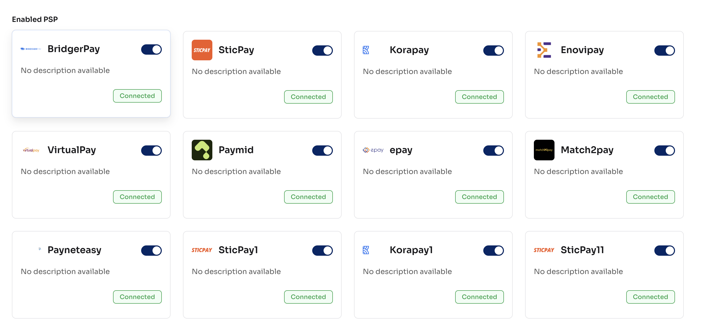

### Available PSPs list

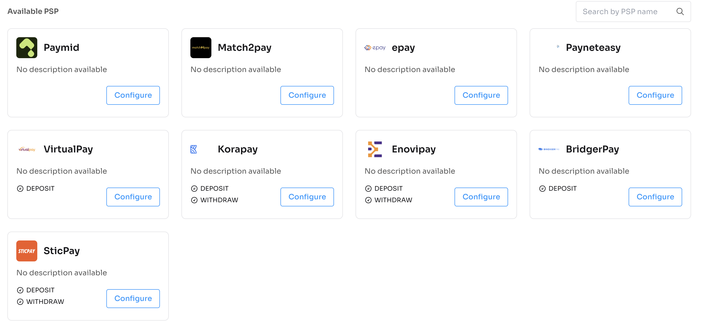

### PSP Details Modal

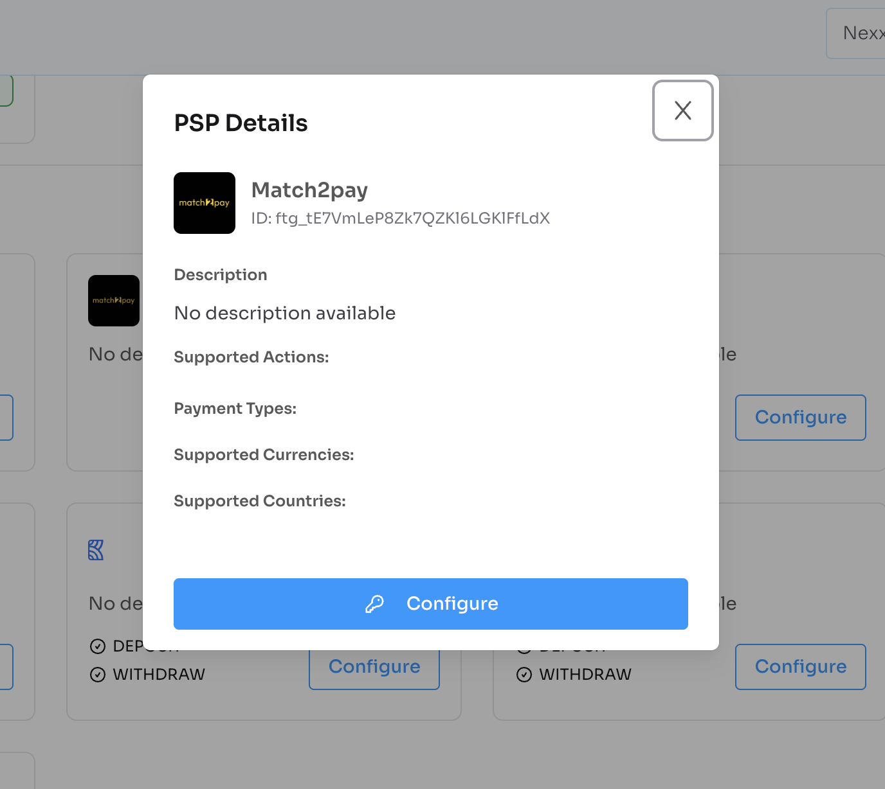

### PSP Configure Modal

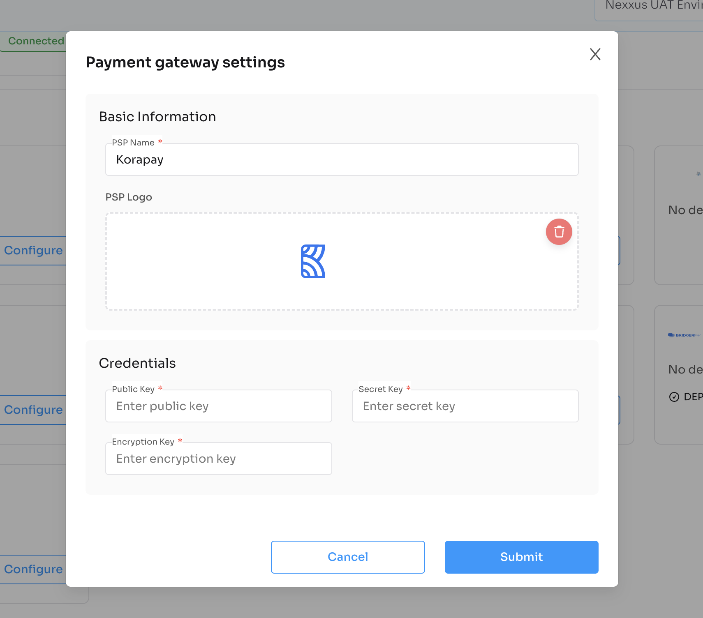

### PSP Details Page

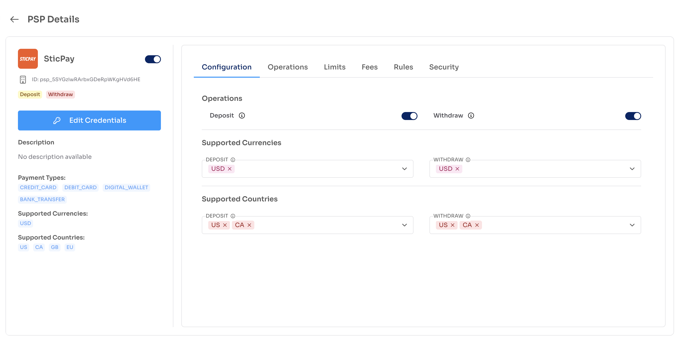

### Credentials Modal

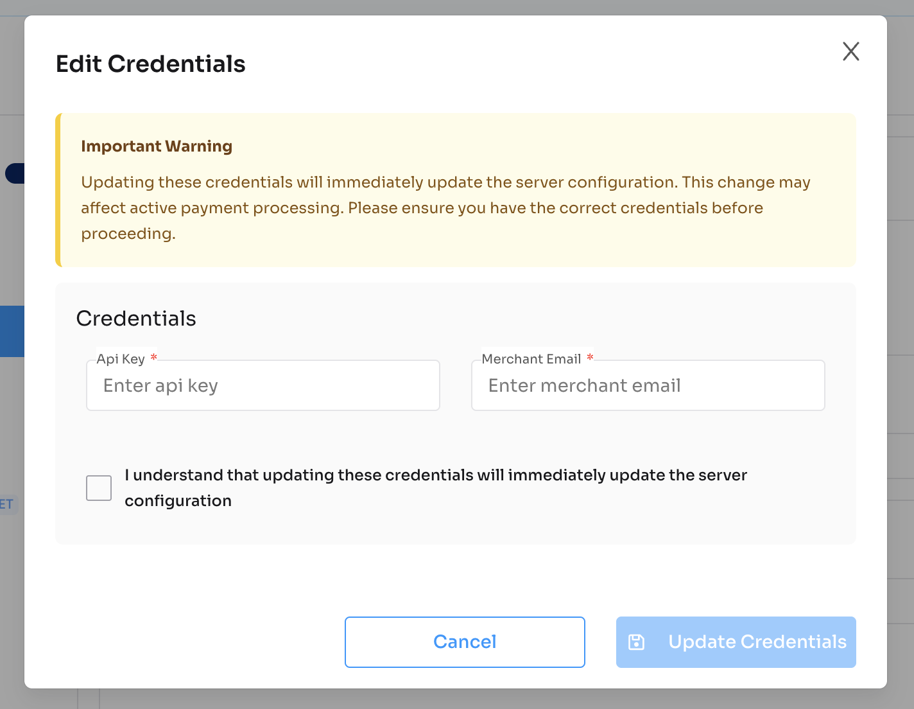

### Detail Tabs

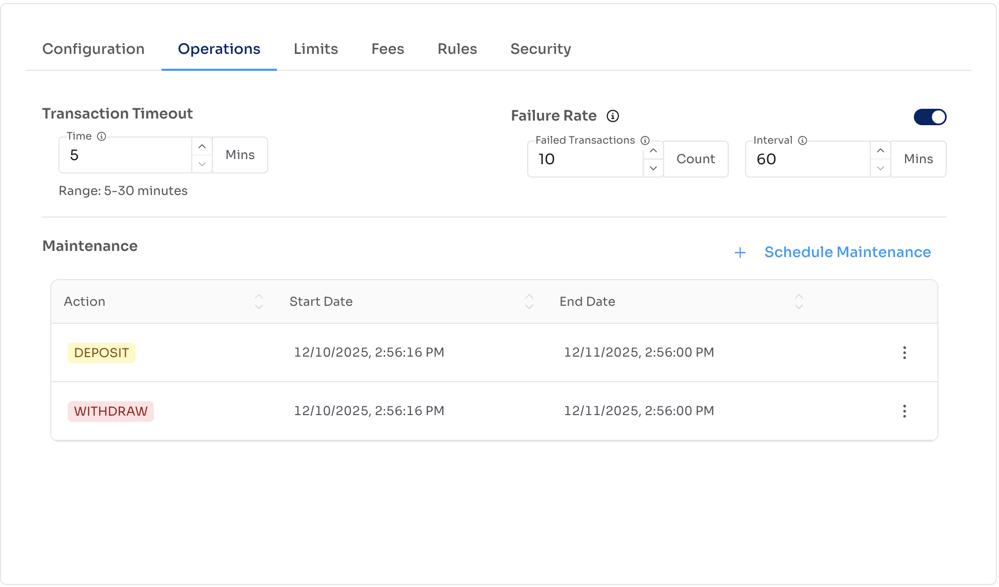
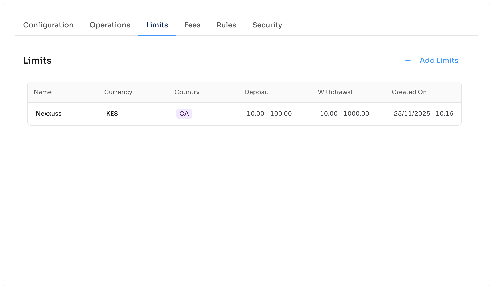
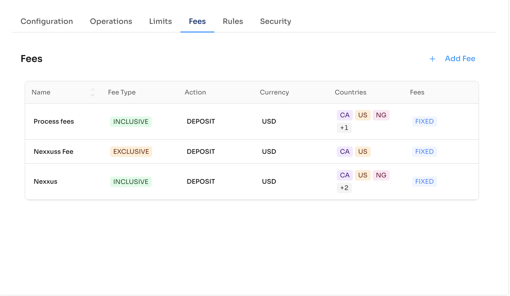
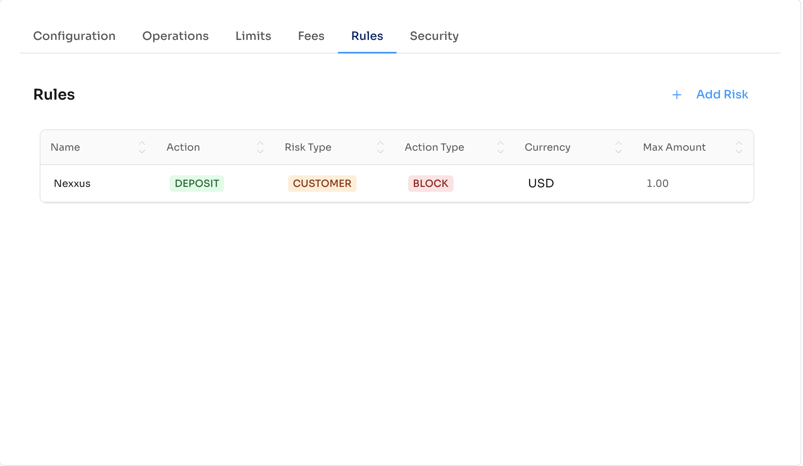
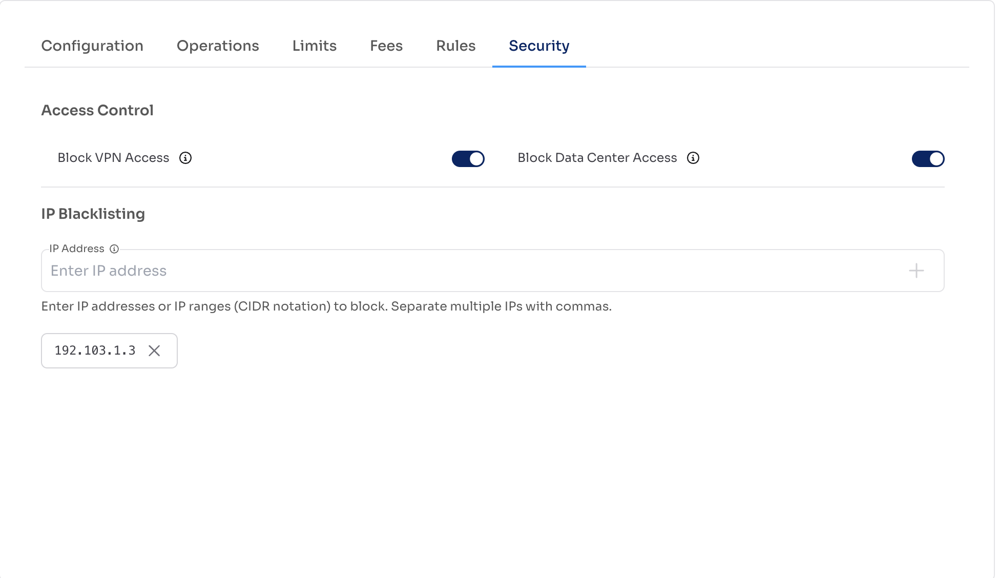
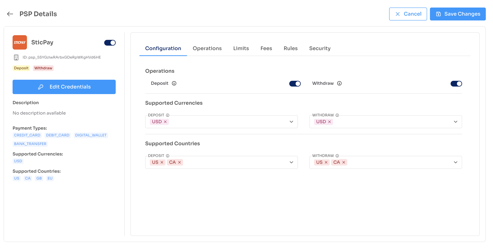
