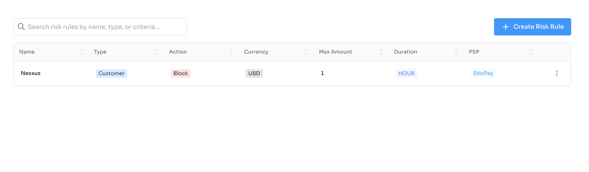
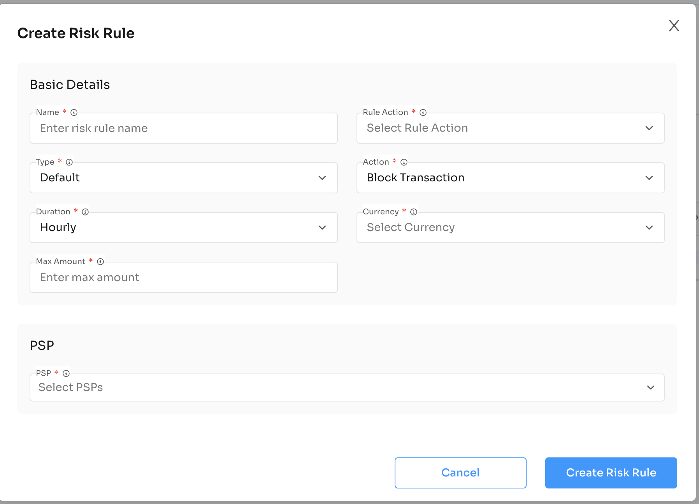

# Risk Rule Component

Plug-and-play React component to manage risk rules and fraud prevention for PSPs using Nexxus APIs.

---

## Installation

```bash
npm install @nexxus/risk-rule
```

---

## Basic Usage

```tsx
import { RiskRule } from "@nexxus/risk-rule";

<RiskRule
  domain="https://crm-api.io"
  header={{ BRAND: "<your-id>" }}
/>;
```

---

## Component Props

| Prop | Type | Required | Description |
| --- | --- | --- | --- |
| `domain` | `string` | Yes | Base API domain (e.g., `https://crm-api.io`). |
| `header` | `object` | No | Optional headers such as `BRAND` or auth tokens. |

---

## Full Example

```tsx
import { NexxusProvider, nexxusThemeSystem } from "@nexxus/react";
import { RiskRule } from "@nexxus/risk-rule";

export default function RiskRulePage() {
  return (
    <NexxusProvider value={nexxusThemeSystem}>
      <RiskRule
        domain="https://crm-api.io"
        header={{ BRAND: "your-brand-id" }}
      />
    </NexxusProvider>
  );
}
```

---

## API Integration Flow (handled internally)

The RiskRule component orchestrates these API calls:

### Get Risk Rules

`GET /api/v1/risk-rules`

Retrieves all risk rules.

```json
{
  "data": [
    {
      "id": "rsk_001",
      "name": "VIP Block Rule",
      "type": "CUSTOMER",
      "action": "BLOCK",
      "criteriaType": "TAG",
      "criteriaValue": ["VIP", "HIGH_RISK"],
      "flowActionName": "DEPOSIT",
      "status": "ACTIVE",
      "psps": [
        { "id": "psp_XM4A6OR9UGyikYRfKczNs0DzQd", "name": "BridgerPay" }
      ],
      "createdAt": "2025-01-15T10:30:00",
      "updatedAt": "2025-01-15T10:30:00"
    }
  ]
}
```

### Get Risk Rules by PSP

`GET /api/v1/risk-rules/psp/{pspId}`

Retrieves risk rules for a specific PSP.

```json
{
  "data": [
    {
      "name": "Nexxus",
      "type": "CUSTOMER",
      "action": "BLOCK",
      "criteriaType": "TAG",
      "criteriaValue": ["VIP"],
      "flowActionName": "DEPOSIT",
      "psps": [{ "id": "psp_5SYGziwRArbxGDeRpWKgHVd6HE", "name": "SticPay" }]
    }
  ]
}
```

### Create Risk Rule

`POST /api/v1/risk-rules`

Creates a new risk rule.

**Request Body:**

```json
{
  "name": "High Value Block",
  "type": "TRANSACTION",
  "action": "BLOCK",
  "criteriaType": "AMOUNT",
  "criteriaValue": {
    "operator": "GREATER_THAN",
    "value": 50000
  },
  "flowActionName": "DEPOSIT",
  "pspIds": ["psp_XM4A6OR9UGyikYRfKczNs0DzQd"]
}
```

**Response:**

```json
{
  "data": {
    "id": "rsk_002",
    "name": "High Value Block",
    "type": "TRANSACTION",
    "action": "BLOCK",
    "criteriaType": "AMOUNT",
    "criteriaValue": {
      "operator": "GREATER_THAN",
      "value": 50000
    },
    "flowActionName": "DEPOSIT",
    "status": "ACTIVE",
    "psps": [{ "id": "psp_XM4A6OR9UGyikYRfKczNs0DzQd", "name": "BridgerPay" }],
    "createdAt": "2025-01-15T10:30:00",
    "updatedAt": "2025-01-15T10:30:00"
  }
}
```

### Update Risk Rule

`PUT /api/v1/risk-rules/{id}`

Updates an existing risk rule.

### Delete Risk Rule

`DELETE /api/v1/risk-rules/{id}`

Deletes a risk rule.

---

## Risk Rule Object

| Field | Type | Description |
| --- | --- | --- |
| `id` | `string` | Unique identifier |
| `name` | `string` | Rule name |
| `type` | `string` | Rule type: `CUSTOMER`, `TRANSACTION`, `VELOCITY` |
| `action` | `string` | Action to take: `BLOCK`, `FLAG`, `REVIEW`, `ALLOW` |
| `criteriaType` | `string` | Criteria type: `TAG`, `AMOUNT`, `COUNTRY`, `VELOCITY` |
| `criteriaValue` | `array\|object` | Criteria values |
| `flowActionName` | `string` | Transaction action: `DEPOSIT`, `WITHDRAW` |
| `status` | `string` | Rule status: `ACTIVE`, `INACTIVE` |
| `psps` | `array` | Associated PSPs |
| `createdAt` | `string` | Creation timestamp |
| `updatedAt` | `string` | Last update timestamp |

---

## Rule Types

### CUSTOMER

Rules based on customer attributes.

```json
{
  "type": "CUSTOMER",
  "criteriaType": "TAG",
  "criteriaValue": ["VIP", "BLOCKED", "HIGH_RISK"]
}
```

### TRANSACTION

Rules based on transaction properties.

```json
{
  "type": "TRANSACTION",
  "criteriaType": "AMOUNT",
  "criteriaValue": {
    "operator": "GREATER_THAN",
    "value": 10000
  }
}
```

### VELOCITY

Rules based on transaction velocity.

```json
{
  "type": "VELOCITY",
  "criteriaType": "VELOCITY",
  "criteriaValue": {
    "count": 5,
    "period": "HOUR",
    "amount": 5000
  }
}
```

---

## Rule Actions

| Action | Description |
| --- | --- |
| `BLOCK` | Block the transaction immediately |
| `FLAG` | Flag for review but allow to proceed |
| `REVIEW` | Hold for manual review |
| `ALLOW` | Explicitly allow (override other rules) |

---

## UI Preview



