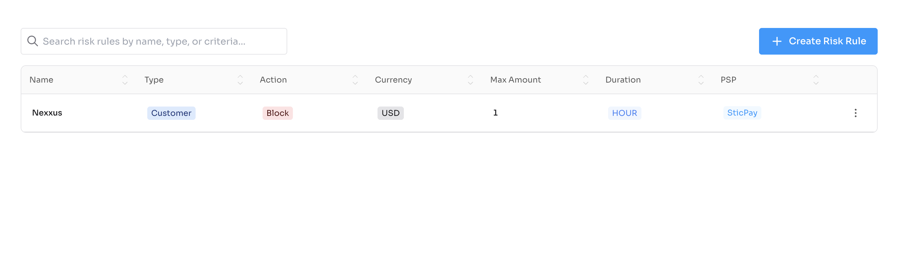
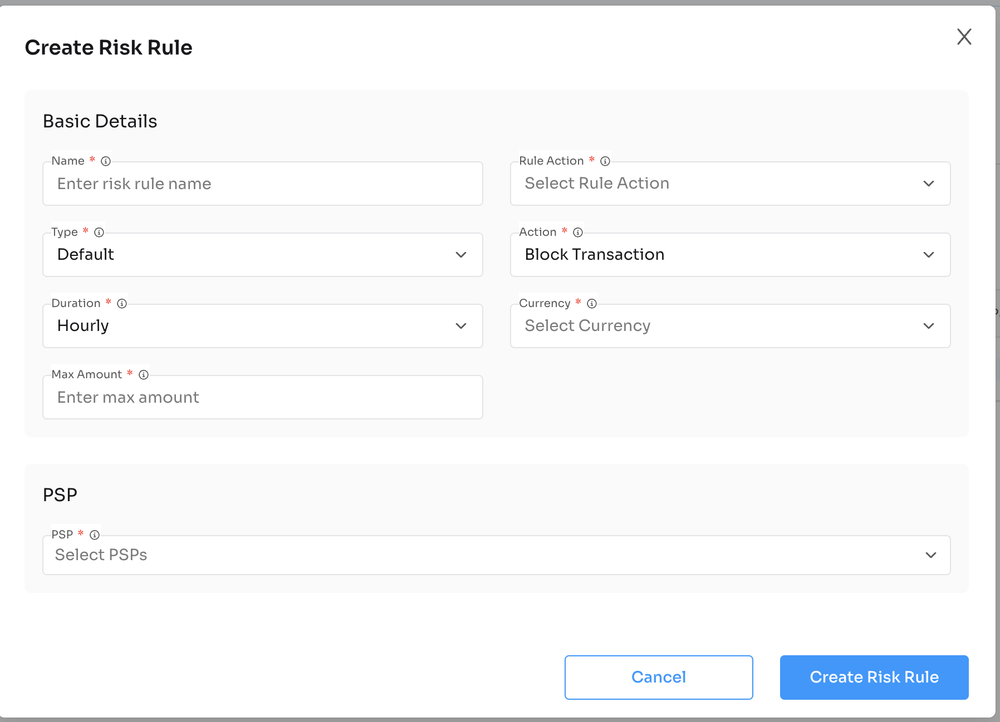

# Risk Rule Component

Plug-and-play React component to manage risk rules and fraud prevention for PSPs using Nexxus APIs.

---

## Installation

```bash
npm install @nexxus/risk-component
```

---

## Basic Usage

```tsx
import RiskComponent from "@nexxus/risk-component";

<RiskComponent
  baseURL="https://api.example.com/nexxus/v1"
  brand="your-brand-id"
  environment="your-env-id"
  flowTypeId="ftp_001"
/>
```

---

## Component Props

| Prop | Type | Required | Description |
| --- | --- | --- | --- |
| `client` | `QueryClient` | No | Custom TanStack Query client. Uses internal client if omitted. |
| `domain` | `string` | No | Base API domain. Alias for `baseURL`. |
| `baseURL` | `string` | No | API base URL (e.g., `https://api.example.com/nexxus/v1`). |
| `secretToken` | `string` | No | API authentication token. Sent as `X-SECRET-TOKEN` header. |
| `header` | `Record<string, string>` | No | Custom headers (e.g., `{ 'X-BRAND-ID': '...' }`). |
| `brand` | `string` | No | Brand identifier. Alias for `brandId`. |
| `brandId` | `string` | No | Brand ID for API scoping. |
| `environment` | `string` | No | Environment identifier. Alias for `environmentId`. |
| `environmentId` | `string` | No | Environment ID for API scoping. |
| `flowTypeId` | `string` | No | Flow type ID to scope risk rules. |

---

## Full Example

```tsx
import { NexxusProvider, nexxusThemeSystem } from "@nexxus/react";
import RiskComponent from "@nexxus/risk-component";

export default function RiskRulePage() {
  return (
    <NexxusProvider value={nexxusThemeSystem}>
      <RiskComponent
        baseURL="https://api.example.com/nexxus/v1"
        brand="your-brand-id"
        environment="your-env-id"
        flowTypeId="ftp_001"
      />
    </NexxusProvider>
  );
}
```

---

## Sub-Components

| Component | Description |
| --- | --- |
| `RiskRuleList` | Table view of risk rules with search, create/edit/delete actions |
| `RiskRuleForm` | Form for creating or editing a risk rule |
| `RiskRuleModal` | Modal wrapper around `RiskRuleForm` |

---

## Form Fields

### Basic Details

| Field | Type | Component | Validation |
| --- | --- | --- | --- |
| `name` | `string` | Input | Required, max 100 chars |
| `flowActionId` | `string` | Select | Required. Options from Flow Action API. |
| `type` | `'DEFAULT' \| 'CUSTOMER'` | Select | Required |
| `action` | `'BLOCK' \| 'ALERT'` | Select | Required |
| `duration` | `'HOUR' \| 'DAY' \| 'WEEK' \| 'MONTH'` | Select | Required |
| `currency` | `string` | Select | Required. Options from Currencies API. |
| `maxAmount` | `number` | NumberInput | Required, >= 0 |

### Customer Criteria (visible when `type === 'CUSTOMER'`)

| Field | Type | Component | Options |
| --- | --- | --- | --- |
| `criteriaType` | `'TAG' \| 'ACCOUNT_TYPE'` | Select | Tags, Account Type |
| `criteriaValue` | `string[]` | MultiSelect | TAG: VIP, VVIP, NORMAL. ACCOUNT_TYPE: INDIVIDUAL, BUSINESS. |

### PSP Configuration

| Field | Type | Component | Validation |
| --- | --- | --- | --- |
| `psps` | `string[]` | MultiSelect | At least 1. Options depend on selected action + currency. |

---

## Rule Types

### DEFAULT

General risk rules with amount thresholds and duration windows.

```json
{
  "type": "DEFAULT",
  "action": "BLOCK",
  "currency": "USD",
  "maxAmount": 50000,
  "duration": "DAY"
}
```

### CUSTOMER

Rules based on customer attributes (tags or account types).

```json
{
  "type": "CUSTOMER",
  "action": "ALERT",
  "criteriaType": "TAG",
  "criteriaValue": ["VIP", "VVIP"],
  "currency": "USD",
  "maxAmount": 10000,
  "duration": "HOUR"
}
```

---

## Rule Actions

| Action | Description |
| --- | --- |
| `BLOCK` | Block the transaction immediately |
| `ALERT` | Flag for review with an alert notification |

---

## Duration Windows

| Duration | Description |
| --- | --- |
| `HOUR` | Hourly threshold window |
| `DAY` | Daily threshold window |
| `WEEK` | Weekly threshold window |
| `MONTH` | Monthly threshold window |

---

## API Integration (handled internally)

| Method | Endpoint | Description |
| --- | --- | --- |
| `getRiskRules` | `GET /risk-rules` | List all risk rules |
| `getRiskRuleById` | `GET /risk-rules/{id}` | Get risk rule by ID (for edit) |
| `createRiskRule` | `POST /risk-rules` | Create a new risk rule |
| `updateRiskRule` | `PUT /risk-rules/{id}` | Update an existing risk rule |
| `deleteRiskRule` | `DELETE /risk-rules/{id}` | Delete a risk rule |
| `getFlowActions` | `GET /flow-types/{flowTypeId}/flow-actions` | Load flow actions |
| `getCurrencies` | `GET /psps/currencies` | Load available currencies |
| `getPSPsByActionAndCurrency` | `GET /psps/{actionId}/ENABLED/{currency}` | Load PSPs by action + currency |

### Example API Payloads

**Create Risk Rule (DEFAULT):**

```json
{
  "name": "High Value Block",
  "type": "DEFAULT",
  "action": "BLOCK",
  "currency": "USD",
  "maxAmount": 50000,
  "duration": "DAY",
  "flowActionId": "fa_deposit_001",
  "status": "ENABLED",
  "psps": [{ "id": "psp_XM4A6OR9UGyikYRfKczNs0DzQd" }]
}
```

**Create Risk Rule (CUSTOMER):**

```json
{
  "name": "VIP Alert Rule",
  "type": "CUSTOMER",
  "action": "ALERT",
  "criteriaType": "TAG",
  "criteriaValue": ["VIP", "VVIP"],
  "currency": "USD",
  "maxAmount": 10000,
  "duration": "HOUR",
  "flowActionId": "fa_deposit_001",
  "status": "ENABLED",
  "psps": [{ "id": "psp_XM4A6OR9UGyikYRfKczNs0DzQd" }]
}
```

---

## Risk Rule Object

| Field | Type | Description |
| --- | --- | --- |
| `id` | `string` | Unique identifier |
| `name` | `string` | Rule name |
| `type` | `'DEFAULT' \| 'CUSTOMER'` | Rule type |
| `action` | `'BLOCK' \| 'ALERT'` | Action to take |
| `currency` | `string` | Currency code |
| `maxAmount` | `number` | Maximum amount threshold |
| `duration` | `'HOUR' \| 'DAY' \| 'WEEK' \| 'MONTH'` | Duration window |
| `flowActionId` | `string` | Associated flow action |
| `status` | `'ENABLED' \| 'DISABLED'` | Rule status |
| `criteriaType` | `'TAG' \| 'ACCOUNT_TYPE'` | Criteria type (CUSTOMER only) |
| `criteriaValue` | `string[]` | Criteria values (CUSTOMER only) |
| `psps` | `{ id, name }[]` | Associated PSPs |
| `createdAt` | `string` | Creation timestamp |
| `updatedAt` | `string` | Last update timestamp |

---

## i18n

The risk component registers translations under the `riskRules` namespace. Supported languages: `en`, `es`, `ar`.

Key sections: `riskRules.types.*`, `riskRules.actions.*`, `riskRules.durations.*`, `riskRules.statuses.*`, `riskRules.criteriaTypes.*`, `riskRules.form.*`, `riskRules.modals.*`, `riskRules.validation.*`.

---

## UI Preview



