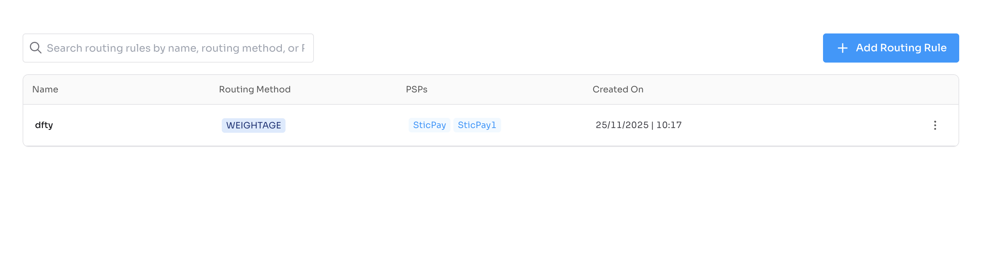
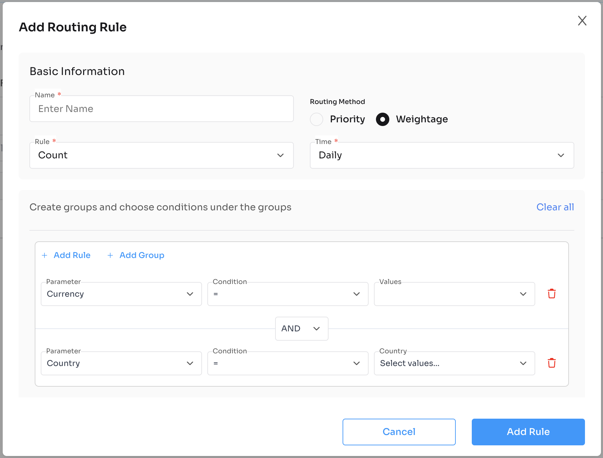

# Routing Rule Component

Plug-and-play React component to manage payment routing rules for PSPs using Nexxus APIs.

---

## Installation

```bash
npm install @nexxus/routing-rule
```

---

## Basic Usage

```tsx
import { RoutingRule } from "@nexxus/routing-rule";

<RoutingRule
  domain="https://crm-api.io"
  header={{ BRAND: "<your-id>" }}
/>;
```

---

## Component Props

| Prop | Type | Required | Description |
| --- | --- | --- | --- |
| `domain` | `string` | Yes | Base API domain (e.g., `https://crm-api.io`). |
| `header` | `object` | No | Optional headers such as `BRAND` or auth tokens. |

---

## Full Example

```tsx
import { NexxusProvider, nexxusThemeSystem } from "@nexxus/react";
import { RoutingRule } from "@nexxus/routing-rule";

export default function RoutingRulePage() {
  return (
    <NexxusProvider value={nexxusThemeSystem}>
      <RoutingRule
        domain="https://crm-api.io"
        header={{ BRAND: "your-brand-id" }}
      />
    </NexxusProvider>
  );
}
```

---

## API Integration Flow (handled internally)

The RoutingRule component orchestrates these API calls:

### Get Routing Rules

`GET /api/v1/routing-rules`

Retrieves all routing rules.

```json
{
  "data": [
    {
      "id": "rtr_001",
      "name": "Primary Routing",
      "priority": 1,
      "status": "ACTIVE",
      "conditions": {
        "currency": ["USD", "EUR"],
        "country": ["US", "CA", "GB"],
        "paymentMethod": ["credit_card", "debit_card"],
        "minAmount": 10,
        "maxAmount": 10000
      },
      "targetPspId": "psp_XM4A6OR9UGyikYRfKczNs0DzQd",
      "fallbackPspId": "psp_5SYGziwRArbxGDeRpWKgHVd6HE",
      "createdAt": "2025-01-15T10:30:00",
      "updatedAt": "2025-01-15T10:30:00"
    }
  ]
}
```

### Get Routing Rule by ID

`GET /api/v1/routing-rules/{id}`

Retrieves a specific routing rule.

```json
{
  "data": {
    "id": "rtr_001",
    "name": "Primary Routing",
    "priority": 1,
    "status": "ACTIVE",
    "conditions": {
      "currency": ["USD", "EUR"],
      "country": ["US", "CA", "GB"],
      "paymentMethod": ["credit_card", "debit_card"],
      "minAmount": 10,
      "maxAmount": 10000
    },
    "targetPspId": "psp_XM4A6OR9UGyikYRfKczNs0DzQd",
    "fallbackPspId": "psp_5SYGziwRArbxGDeRpWKgHVd6HE"
  }
}
```

### Create Routing Rule

`POST /api/v1/routing-rules`

Creates a new routing rule.

**Request Body:**

```json
{
  "name": "EU Routing",
  "priority": 2,
  "conditions": {
    "currency": ["EUR", "GBP"],
    "country": ["DE", "FR", "GB", "IT", "ES"],
    "paymentMethod": ["credit_card", "bank_transfer"],
    "minAmount": 50,
    "maxAmount": 25000
  },
  "targetPspId": "psp_XM4A6OR9UGyikYRfKczNs0DzQd",
  "fallbackPspId": "psp_5SYGziwRArbxGDeRpWKgHVd6HE"
}
```

**Response:**

```json
{
  "data": {
    "id": "rtr_002",
    "name": "EU Routing",
    "priority": 2,
    "status": "ACTIVE",
    "conditions": {
      "currency": ["EUR", "GBP"],
      "country": ["DE", "FR", "GB", "IT", "ES"],
      "paymentMethod": ["credit_card", "bank_transfer"],
      "minAmount": 50,
      "maxAmount": 25000
    },
    "targetPspId": "psp_XM4A6OR9UGyikYRfKczNs0DzQd",
    "fallbackPspId": "psp_5SYGziwRArbxGDeRpWKgHVd6HE",
    "createdAt": "2025-01-15T10:30:00",
    "updatedAt": "2025-01-15T10:30:00"
  }
}
```

### Update Routing Rule

`PUT /api/v1/routing-rules/{id}`

Updates an existing routing rule.

### Delete Routing Rule

`DELETE /api/v1/routing-rules/{id}`

Deletes a routing rule.

---

## Routing Rule Object

| Field | Type | Description |
| --- | --- | --- |
| `id` | `string` | Unique identifier |
| `name` | `string` | Rule name |
| `priority` | `number` | Rule priority (lower = higher priority) |
| `status` | `string` | Rule status: `ACTIVE`, `INACTIVE` |
| `conditions` | `object` | Matching conditions |
| `conditions.currency` | `array` | Supported currencies |
| `conditions.country` | `array` | Supported countries |
| `conditions.paymentMethod` | `array` | Supported payment methods |
| `conditions.minAmount` | `number` | Minimum transaction amount |
| `conditions.maxAmount` | `number` | Maximum transaction amount |
| `targetPspId` | `string` | Primary PSP for routing |
| `fallbackPspId` | `string` | Fallback PSP if primary fails |
| `createdAt` | `string` | Creation timestamp |
| `updatedAt` | `string` | Last update timestamp |

---

## Routing Priority

Routing rules are evaluated in priority order (lowest number first). When a transaction matches multiple rules, the highest priority rule is applied.

```
Priority 1: VIP Customers → Premium PSP
Priority 2: EU Region → EU PSP
Priority 3: Default → Standard PSP
```

---

## UI Preview



