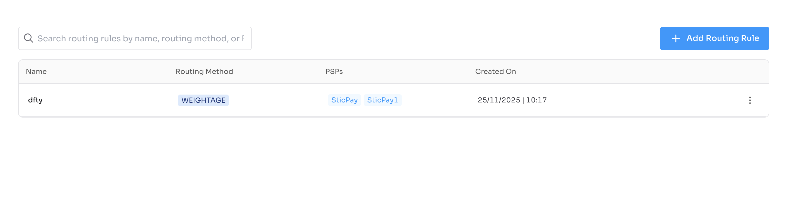
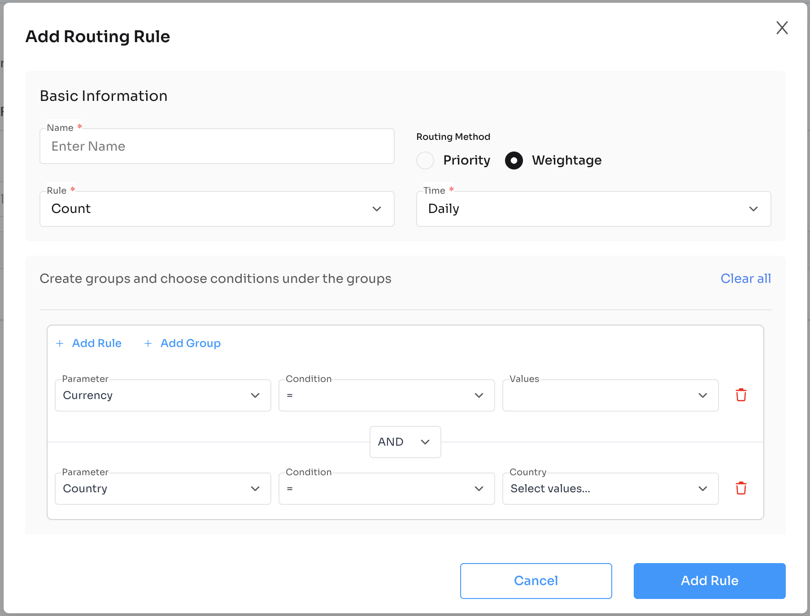

# Routing Rule Component

Plug-and-play React component to manage payment routing rules with priority or weightage-based PSP selection using Nexxus APIs.

---

## Installation

```bash
npm install @nexxus/routing-component
```

---

## Basic Usage

```tsx
import RoutingComponent from "@nexxus/routing-component";

<RoutingComponent
  baseURL="https://api.example.com/nexxus/v1"
  brand="your-brand-id"
  environment="your-env-id"
  flowTypeId="ftp_001"
/>
```

---

## Component Props

| Prop | Type | Required | Description |
| --- | --- | --- | --- |
| `client` | `QueryClient` | No | Custom TanStack Query client. Uses internal client if omitted. |
| `domain` | `string` | No | Base API domain. Alias for `baseURL`. |
| `baseURL` | `string` | No | API base URL (e.g., `https://api.example.com/nexxus/v1`). |
| `secretToken` | `string` | No | API authentication token. Sent as `X-SECRET-TOKEN` header. |
| `header` | `Record<string, string>` | No | Custom headers (e.g., `{ 'X-BRAND-ID': '...' }`). |
| `brand` | `string` | No | Brand identifier. Alias for `brandId`. |
| `brandId` | `string` | No | Brand ID for API scoping. |
| `environment` | `string` | No | Environment identifier. Alias for `environmentId`. |
| `environmentId` | `string` | No | Environment ID for API scoping. |
| `flowTypeId` | `string` | No | Flow type ID to scope routing rules. |
| `language` | `string` | No | UI language. Built-ins: `'en' \| 'es' \| 'ar'`; register more via `NexxusProvider`'s `translations` prop. Omit to keep the current/detected language. |

---

## Full Example

```tsx
import { NexxusProvider, nexxusThemeSystem } from "@nexxus/react";
import RoutingComponent from "@nexxus/routing-component";

export default function RoutingRulePage() {
  return (
    <NexxusProvider theme={nexxusThemeSystem}>
      <RoutingComponent
        baseURL="https://api.example.com/nexxus/v1"
        brand="your-brand-id"
        environment="your-env-id"
        flowTypeId="ftp_001"
      />
    </NexxusProvider>
  );
}
```

---

## Sub-Components

| Component | Description |
| --- | --- |
| `RoutingRuleList` | Table view of routing rules with search, create/edit/delete |
| `RoutingRuleForm` | Full form with basic info, query builder, and PSP ordering |
| `RoutingRuleModal` | Modal wrapper around `RoutingRuleForm` |
| `BasicInformation` | Name, routing method, rule type, and time fields |
| `QueryBuilderSection` | Condition builder for currency/country filtering |
| `RoutingOrderSection` | PSP ordering section (switches between priority/weightage) |
| `PriorityRoutingOrder` | Drag-and-drop PSP priority list |
| `WeightageRoutingOrder` | PSP list with value inputs for weight distribution |

---

## Form Fields

### Basic Information

| Field | Type | Component | Validation |
| --- | --- | --- | --- |
| `name` | `string` | Input | Required, max 100 chars |
| `routingMethod` | `'PRIORITY' \| 'WEIGHTAGE'` | RadioGroup | Required |
| `rule` | `'COUNT' \| 'AMOUNT' \| 'PERCENTAGE'` | Select | Required when WEIGHTAGE |
| `time` | `'HOUR' \| 'DAY' \| 'WEEK' \| 'MONTH'` | Select | Required when WEIGHTAGE |

### Query Builder (Conditions)

Built with `react-querybuilder` and `@react-querybuilder/chakra`:

| Field | Type | Description |
| --- | --- | --- |
| `currency` | Multi-select | Filter by currencies |
| `country` | Multi-select | Filter by countries |

Conditions support combinators (`AND` / `OR`) and operators (`=`, `!=`, etc.).

### Routing Order

#### Priority Mode

PSPs are ordered by drag-and-drop. The first PSP has highest priority.

| Field | Type | Description |
| --- | --- | --- |
| PSP | Select | Select from configured PSPs |

#### Weightage Mode

Each PSP gets a value that determines routing weight.

| Field | Type | Description |
| --- | --- | --- |
| PSP | Select | Select from configured PSPs |
| Value | NumberInput | Weight value (label depends on rule type: Count, Amount, or Percentage) |

---

## Routing Methods

### PRIORITY

Routes transactions to PSPs in order of priority. If the primary PSP fails, the next in line is used.

```
Priority 1: Premium PSP    (first choice)
Priority 2: Standard PSP   (fallback)
Priority 3: Backup PSP     (last resort)
```

### WEIGHTAGE

Distributes transactions across PSPs based on configured weights. Combined with a rule type:

| Rule Type | Description | Example |
| --- | --- | --- |
| `COUNT` | Distribute by transaction count | PSP A: 70 txns, PSP B: 30 txns |
| `AMOUNT` | Distribute by transaction amount | PSP A: $70,000, PSP B: $30,000 |
| `PERCENTAGE` | Distribute by percentage | PSP A: 70%, PSP B: 30% |

The `time` field (`HOUR`, `DAY`, `WEEK`, `MONTH`) defines the window for weight calculation.

---

## API Integration (handled internally)

| Method | Endpoint | Description |
| --- | --- | --- |
| `getRoutingRules` | `GET /routing-rules` | List all routing rules |
| `getRoutingRuleById` | `GET /routing-rules/{id}` | Get routing rule by ID (for edit) |
| `createRoutingRule` | `POST /routing-rules` | Create a new routing rule |
| `updateRoutingRule` | `PUT /routing-rules/{id}` | Update an existing routing rule |
| `deleteRoutingRule` | `DELETE /routing-rules/{id}` | Delete a routing rule |
| `getConfiguredPSPs` | `GET /psps` | Load configured PSPs for PSP selection |

### Example API Payloads

**Create Routing Rule (Priority):**

```json
{
  "name": "Primary Routing",
  "pspSelectionMode": "PRIORITY",
  "routingType": null,
  "duration": null,
  "conditionJson": {
    "combinator": "and",
    "rules": [
      { "field": "currency", "operator": "=", "value": ["USD", "EUR"] },
      { "field": "country", "operator": "=", "value": ["US", "CA"] }
    ]
  },
  "status": "ENABLED",
  "psps": [
    { "pspId": "psp_001", "pspOrder": 1 },
    { "pspId": "psp_002", "pspOrder": 2 }
  ]
}
```

**Create Routing Rule (Weightage):**

```json
{
  "name": "Weighted Distribution",
  "pspSelectionMode": "WEIGHTAGE",
  "routingType": "PERCENTAGE",
  "duration": "DAY",
  "conditionJson": {
    "combinator": "and",
    "rules": [
      { "field": "currency", "operator": "=", "value": ["USD"] }
    ]
  },
  "status": "ENABLED",
  "psps": [
    { "pspId": "psp_001", "pspValue": 70, "pspOrder": 1 },
    { "pspId": "psp_002", "pspValue": 30, "pspOrder": 2 }
  ]
}
```

---

## Routing Rule Object

| Field | Type | Description |
| --- | --- | --- |
| `id` | `string` | Unique identifier |
| `version` | `number` | Rule version |
| `name` | `string` | Rule name |
| `brandId` | `string` | Brand ID |
| `environmentId` | `string` | Environment ID |
| `pspSelectionMode` | `'PRIORITY' \| 'WEIGHTAGE'` | Routing method |
| `routingType` | `'COUNT' \| 'AMOUNT' \| 'PERCENTAGE' \| null` | Weight rule type (WEIGHTAGE only) |
| `duration` | `'HOUR' \| 'DAY' \| 'WEEK' \| 'MONTH' \| null` | Time window (WEIGHTAGE only) |
| `conditionJson` | `object` | Query builder conditions |
| `status` | `'ENABLED' \| 'DISABLED'` | Rule status |
| `psps` | `PSP[]` | Ordered PSP list |
| `psps[].pspId` | `string` | PSP identifier |
| `psps[].pspName` | `string` | PSP display name |
| `psps[].pspOrder` | `number` | PSP order/priority |
| `psps[].pspValue` | `number?` | Weight value (WEIGHTAGE only) |
| `createdAt` | `string` | Creation timestamp |
| `updatedAt` | `string` | Last update timestamp |

---

## Dependencies

The routing component uses these additional libraries:

- `@dnd-kit/core`, `@dnd-kit/sortable` - Drag-and-drop PSP ordering
- `react-querybuilder`, `@react-querybuilder/chakra` - Visual condition builder
- `react-hook-form`, `zod` - Form management and validation

---

## i18n

The routing component registers translations under the `routingRules` namespace. Supported languages: `en`, `es`, `ar`.

Key sections: `routingRules.methods.*`, `routingRules.rules.*`, `routingRules.times.*`, `routingRules.form.*`, `routingRules.modals.*`.

---

## UI Preview



