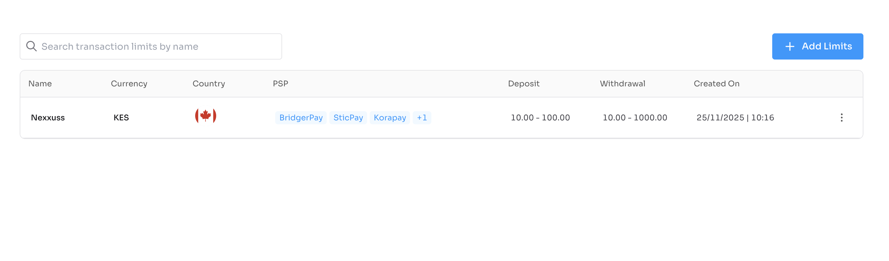
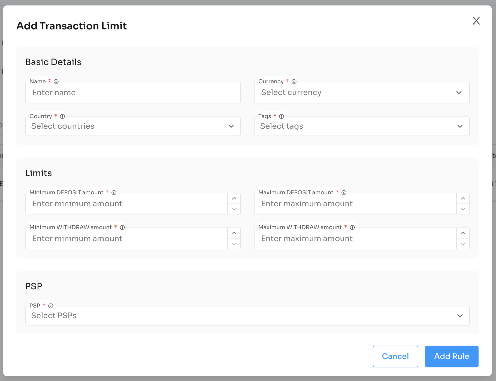

# Transaction Rule Component

Plug-and-play React component to manage transaction limits and rules for PSPs using Nexxus APIs.

---

## Installation

```bash
npm install @nexxus/transaction-rule
```

---

## Basic Usage

```tsx
import { TransactionRule } from "@nexxus/transaction-rule";

<TransactionRule
  domain="https://crm-api.io"
  header={{ BRAND: "<your-id>" }}
/>;
```

---

## Component Props

| Prop | Type | Required | Description |
| --- | --- | --- | --- |
| `domain` | `string` | Yes | Base API domain (e.g., `https://crm-api.io`). |
| `header` | `object` | No | Optional headers such as `BRAND` or auth tokens. |

---

## Full Example

```tsx
import { NexxusProvider, nexxusThemeSystem } from "@nexxus/react";
import { TransactionRule } from "@nexxus/transaction-rule";

export default function TransactionRulePage() {
  return (
    <NexxusProvider value={nexxusThemeSystem}>
      <TransactionRule
        domain="https://crm-api.io"
        header={{ BRAND: "your-brand-id" }}
      />
    </NexxusProvider>
  );
}
```

---

## API Integration Flow (handled internally)

The TransactionRule component orchestrates these API calls:

### Get Transaction Limits

`GET /api/v1/transaction-limits`

Retrieves all transaction limits.

```json
{
  "data": [
    {
      "id": "txl_001",
      "name": "Standard Limits",
      "currency": "USD",
      "pspActions": [
        { "flowActionName": "DEPOSIT", "minAmount": 10, "maxAmount": 10000 },
        { "flowActionName": "WITHDRAW", "minAmount": 10, "maxAmount": 5000 }
      ],
      "psps": [
        { "id": "psp_XM4A6OR9UGyikYRfKczNs0DzQd", "name": "BridgerPay" }
      ],
      "createdAt": "2025-01-15T10:30:00",
      "updatedAt": "2025-01-15T10:30:00"
    }
  ]
}
```

### Get Transaction Limits by PSP

`GET /api/v1/transaction-limits/psp/{pspId}`

Retrieves transaction limits for a specific PSP.

```json
{
  "data": [
    {
      "name": "Nexxuss",
      "currency": "KES",
      "pspActions": [
        { "flowActionName": "DEPOSIT", "minAmount": 10, "maxAmount": 100 },
        { "flowActionName": "WITHDRAW", "minAmount": 10, "maxAmount": 1000 }
      ],
      "psps": [{ "id": "psp_XM4A6OR9UGyikYRfKczNs0DzQd", "name": "BridgerPay" }]
    }
  ]
}
```

### Create Transaction Limit

`POST /api/v1/transaction-limits`

Creates a new transaction limit rule.

**Request Body:**

```json
{
  "name": "Premium Limits",
  "currency": "USD",
  "pspActions": [
    { "flowActionName": "DEPOSIT", "minAmount": 100, "maxAmount": 50000 },
    { "flowActionName": "WITHDRAW", "minAmount": 50, "maxAmount": 25000 }
  ],
  "pspIds": ["psp_XM4A6OR9UGyikYRfKczNs0DzQd"]
}
```

**Response:**

```json
{
  "data": {
    "id": "txl_002",
    "name": "Premium Limits",
    "currency": "USD",
    "pspActions": [
      { "flowActionName": "DEPOSIT", "minAmount": 100, "maxAmount": 50000 },
      { "flowActionName": "WITHDRAW", "minAmount": 50, "maxAmount": 25000 }
    ],
    "psps": [{ "id": "psp_XM4A6OR9UGyikYRfKczNs0DzQd", "name": "BridgerPay" }],
    "createdAt": "2025-01-15T10:30:00",
    "updatedAt": "2025-01-15T10:30:00"
  }
}
```

### Update Transaction Limit

`PUT /api/v1/transaction-limits/{id}`

Updates an existing transaction limit rule.

### Delete Transaction Limit

`DELETE /api/v1/transaction-limits/{id}`

Deletes a transaction limit rule.

---

## Transaction Limit Object

| Field | Type | Description |
| --- | --- | --- |
| `id` | `string` | Unique identifier |
| `name` | `string` | Rule name |
| `currency` | `string` | Currency code (e.g., USD, EUR) |
| `pspActions` | `array` | Array of action limits |
| `pspActions[].flowActionName` | `string` | Action type: `DEPOSIT`, `WITHDRAW` |
| `pspActions[].minAmount` | `number` | Minimum transaction amount |
| `pspActions[].maxAmount` | `number` | Maximum transaction amount |
| `psps` | `array` | Associated PSPs |
| `createdAt` | `string` | Creation timestamp |
| `updatedAt` | `string` | Last update timestamp |

---

## UI Preview



