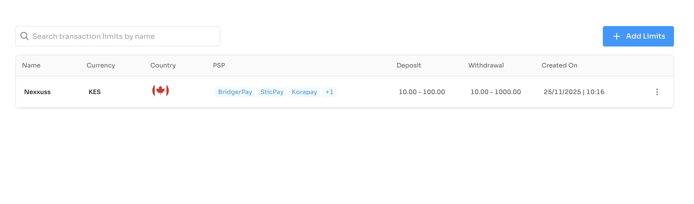
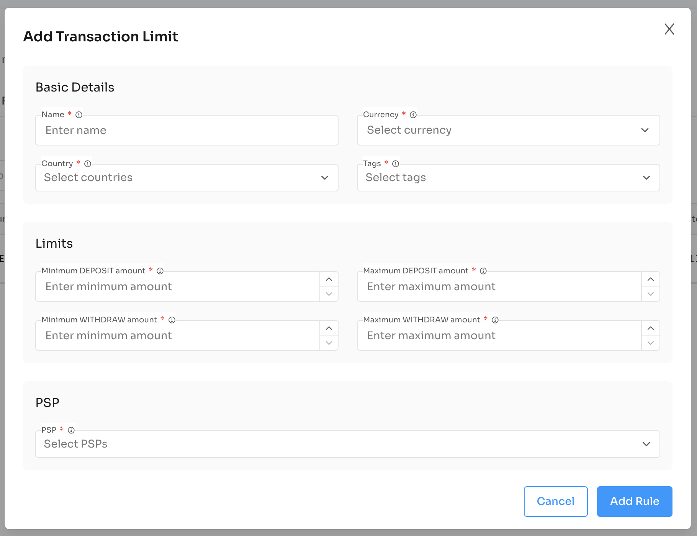

# Transaction Limits Component

Plug-and-play React component to manage transaction limits per flow action, currency, country, and customer tag using Nexxus APIs.

---

## Installation

```bash
npm install @nexxus/transaction-component
```

---

## Basic Usage

```tsx
import TransactionLimitsComponent from "@nexxus/transaction-component";

<TransactionLimitsComponent
  baseURL="https://api.example.com/nexxus/v1"
  brand="your-brand-id"
  environment="your-env-id"
  flowTypeId="ftp_001"
/>
```

---

## Component Props

| Prop | Type | Required | Description |
| --- | --- | --- | --- |
| `client` | `QueryClient` | No | Custom TanStack Query client. Uses internal client if omitted. |
| `domain` | `string` | No | Base API domain. Alias for `baseURL`. |
| `baseURL` | `string` | No | API base URL (e.g., `https://api.example.com/nexxus/v1`). |
| `secretToken` | `string` | No | API authentication token. Sent as `X-SECRET-TOKEN` header. |
| `header` | `Record<string, string>` | No | Custom headers (e.g., `{ 'X-BRAND-ID': '...' }`). |
| `brand` | `string` | No | Brand identifier. Alias for `brandId`. |
| `brandId` | `string` | No | Brand ID for API scoping. |
| `environment` | `string` | No | Environment identifier. Alias for `environmentId`. |
| `environmentId` | `string` | No | Environment ID for API scoping. |
| `flowTypeId` | `string` | No | Flow type ID to scope transaction limits and load flow actions. |
| `language` | `string` | No | UI language. Built-ins: `'en' \| 'es' \| 'ar'`; register more via `NexxusProvider`'s `translations` prop. Omit to keep the current/detected language. |

---

## Full Example

```tsx
import { NexxusProvider, nexxusThemeSystem } from "@nexxus/react";
import TransactionLimitsComponent from "@nexxus/transaction-component";

export default function TransactionLimitsPage() {
  return (
    <NexxusProvider theme={nexxusThemeSystem}>
      <TransactionLimitsComponent
        baseURL="https://api.example.com/nexxus/v1"
        brand="your-brand-id"
        environment="your-env-id"
        flowTypeId="ftp_001"
      />
    </NexxusProvider>
  );
}
```

---

## Sub-Components

| Component | Description |
| --- | --- |
| `TransactionLimitList` | Table view with search, create/edit/delete actions |
| `TransactionLimitForm` | Form for creating or editing a transaction limit |
| `TransactionLimitModal` | Modal wrapper around `TransactionLimitForm` |
| `useTableColumns` | Hook that returns table column definitions |

---

## Form Fields

### Basic Details

| Field | Type | Component | Validation |
| --- | --- | --- | --- |
| `name` | `string` | Input | Required, max 100 chars |
| `currency` | `string` | Select | Required. Options from Currencies API. |
| `countries` | `string[]` | MultiSelect | At least 1. Options from Countries API. |
| `tags` | `string[]` | MultiSelect | At least 1. Predefined customer tag options. |

### Customer Tags

| Value | Label |
| --- | --- |
| `Banned` | Banned |
| `VIP` | VIP |
| `Important` | Important |
| `Premium` | Premium |
| `Standard` | Standard |
| `New Customer` | New Customer |

### Limits (dynamic per flow action)

For each flow action returned by the API (e.g., DEPOSIT, WITHDRAW), the form renders:

| Field | Type | Component | Validation |
| --- | --- | --- | --- |
| `{action}MinAmount` | `number` | NumberInput | Required, positive, must be < maxAmount |
| `{action}MaxAmount` | `number` | NumberInput | Required, positive, must be > minAmount |

### PSP Configuration

| Field | Type | Component | Validation |
| --- | --- | --- | --- |
| `psps` | `string[]` | MultiSelect | At least 1. Options from configured PSPs API. |

---

## Table Columns

| Column | Field | Description |
| --- | --- | --- |
| Name | `name` | Limit rule name |
| Currency | `currency` | Currency code |
| Country | `countries` | Applicable countries |
| PSP | `psps` | Associated PSPs |
| Deposit | derived | Min-Max for DEPOSIT action |
| Withdrawal | derived | Min-Max for WITHDRAW action |
| Created On | `createdAt` | Creation timestamp |
| Actions | - | Edit / delete buttons |

---

## API Integration (handled internally)

| Method | Endpoint | Description |
| --- | --- | --- |
| `getTransactionLimits` | `GET /transaction-limits` | List all transaction limits |
| `getTransactionLimitById` | `GET /transaction-limits/{id}` | Get limit by ID (for edit) |
| `createTransactionLimit` | `POST /transaction-limits` | Create a new transaction limit |
| `updateTransactionLimit` | `PUT /transaction-limits/{id}` | Update an existing limit |
| `deleteTransactionLimit` | `DELETE /transaction-limits/{id}` | Delete a transaction limit |
| `getFlowActions` | `GET /flow-types/{flowTypeId}/flow-actions` | Load flow actions for dynamic limit fields |
| `getCurrencies` | `GET /psps/currencies` | Load available currencies |
| `getCountries` | `GET /psps/countries` | Load available countries |
| `getConfiguredPSPs` | `GET /psps` | Load configured PSPs |

### Example API Payloads

**Create Transaction Limit:**

```json
{
  "name": "Premium Limits",
  "currency": "USD",
  "countries": ["US", "CA"],
  "customerTags": ["VIP", "Premium"],
  "status": "ENABLED",
  "pspActions": [
    { "flowActionId": "fa_deposit_001", "minAmount": 100, "maxAmount": 50000 },
    { "flowActionId": "fa_withdraw_001", "minAmount": 50, "maxAmount": 25000 }
  ],
  "psps": [{ "id": "psp_XM4A6OR9UGyikYRfKczNs0DzQd" }]
}
```

**Transaction Limit Response:**

```json
{
  "data": {
    "id": "txl_002",
    "name": "Premium Limits",
    "currency": "USD",
    "countries": ["US", "CA"],
    "customerTags": ["VIP", "Premium"],
    "status": "ENABLED",
    "pspActions": [
      { "flowActionId": "fa_deposit_001", "minAmount": 100, "maxAmount": 50000 },
      { "flowActionId": "fa_withdraw_001", "minAmount": 50, "maxAmount": 25000 }
    ],
    "psps": [{ "id": "psp_XM4A6OR9UGyikYRfKczNs0DzQd", "name": "BridgerPay" }],
    "createdAt": "2025-01-15T10:30:00",
    "updatedAt": "2025-01-15T10:30:00"
  }
}
```

---

## Transaction Limit Object

| Field | Type | Description |
| --- | --- | --- |
| `id` | `string` | Unique identifier |
| `version` | `number` | Record version |
| `name` | `string` | Rule name |
| `brandId` | `string` | Brand ID |
| `environmentId` | `string` | Environment ID |
| `currency` | `string` | Currency code (e.g., USD, EUR) |
| `countries` | `string[]` | Applicable countries |
| `customerTags` | `string[]` | Customer tag filters |
| `status` | `'ENABLED' \| 'DISABLED'` | Rule status |
| `pspActions` | `PSPAction[]` | Per-action limit definitions |
| `pspActions[].flowActionId` | `string` | Flow action ID |
| `pspActions[].minAmount` | `number` | Minimum transaction amount |
| `pspActions[].maxAmount` | `number` | Maximum transaction amount |
| `psps` | `{ id, name }[]` | Associated PSPs |
| `createdAt` | `string` | Creation timestamp |
| `updatedAt` | `string` | Last update timestamp |

---

## i18n

The transaction component registers translations under the `transactionLimits` namespace. Supported languages: `en`, `es`, `ar`.

Key sections: `transactionLimits.form.*`, `transactionLimits.tags.*`, `transactionLimits.modals.*`, `transactionLimits.validation.*`, `transactionLimits.messages.*`.

---

## UI Preview



