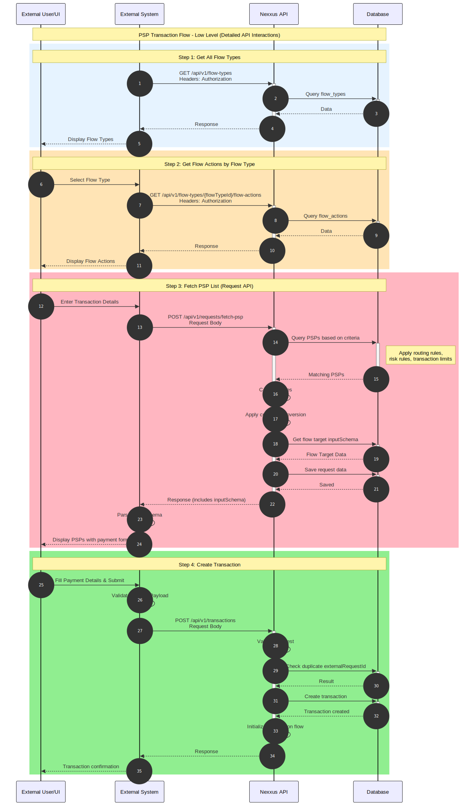

# API Reference

Complete reference documentation for all PSP transaction flow API endpoints.

## Low-Level Flow Diagram



**Detailed API Interactions**

The diagram above shows the detailed sequence of API calls and internal processing steps. It illustrates:

- **Step 1**: Query flow types from the database
- **Step 2**: Retrieve flow actions for the selected flow type
- **Step 3**: Complex PSP evaluation process including:
  - Querying PSPs based on transaction criteria
  - Calculating fees
  - Applying currency conversion
  - Retrieving flow target input schema
  - Saving request data
  - Returning response with inputSchema included

This detailed view helps developers understand the internal processing that occurs within the Nexxus API during each step.

## Base URL

All API endpoints are prefixed with `/api/v1`.

## Common Response Format

All API responses follow this structure:

**Success Response**:
```json
{
  "success": true,
  "data": <response_data>,
  "message": "Operation successful"
}
```

**Error Response**:
```json
{
  "success": false,
  "error": {
    "code": "ERROR_CODE",
    "message": "Error description",
    "details": {}
  },
  "message": "Operation failed"
}
```

## HTTP Status Codes

- `200 OK`: Request successful
- `201 Created`: Resource created successfully
- `400 Bad Request`: Invalid request data or validation error
- `401 Unauthorized`: Invalid or missing authentication token
- `403 Forbidden`: Insufficient permissions or scope
- `404 Not Found`: Resource not found
- `409 Conflict`: Resource conflict (e.g., duplicate transaction)
- `500 Internal Server Error`: Server error

---

## Authentication

### Login

Obtain JWT access token for API authentication.

**Endpoint**: `POST /api/v1/auth/login`

**Headers**:
```
Content-Type: application/json
```

**Request Body**:
```json
{
  "username": "your_username",
  "password": "your_password"
}
```

**Response** (200 OK):
```json
{
  "success": true,
  "data": {
    "accessToken": "eyJhbGciOiJIUzI1NiIsInR5cCI6IkpXVCJ9...",
    "refreshToken": "eyJhbGciOiJIUzI1NiIsInR5cCI6IkpXVCJ9...",
    "expiresIn": 3600
  },
  "message": "Authentication successful"
}
```

---

## Step 1: Get Flow Types

Retrieve all available flow types to identify the PSP identifier record.

**Endpoint**: `GET /api/v1/flow-types`

**Headers**:
```
Authorization: Bearer <token>
```

**Request**: No request body required

**Response** (200 OK):
```json
{
  "success": true,
  "data": [
    {
      "id": "flow_type_001",
      "name": "Payment",
      "description": "Payment transaction flow",
      "createdAt": "2024-01-15T10:30:00",
      "updatedAt": "2024-01-15T10:30:00"
    },
    {
      "id": "flow_type_002",
      "name": "Refund",
      "description": "Refund transaction flow",
      "createdAt": "2024-01-15T10:30:00",
      "updatedAt": "2024-01-15T10:30:00"
    }
  ],
  "message": "Flow types retrieved successfully"
}
```

**Response Fields**:
- `id` (string): Unique identifier of the flow type (use this in Step 2)
- `name` (string): Name of the flow type (e.g., "Payment", "Refund")
- `description` (string): Description of the flow type
- `createdAt` (datetime): Creation timestamp
- `updatedAt` (datetime): Last update timestamp

**Error Responses**:
- `401 Unauthorized`: Invalid or missing authentication token
- `500 Internal Server Error`: Server error

---

## Step 2: Get Flow Actions

Retrieve all flow actions associated with a specific flow type.

**Endpoint**: `GET /api/v1/flow-types/{flowTypeId}/flow-actions`

**Path Parameters**:
- `flowTypeId` (string, required): The flow type ID obtained from Step 1

**Headers**:
```
Authorization: Bearer <token>
```

**Example Request**:
```
GET /api/v1/flow-types/flow_type_001/flow-actions
Authorization: Bearer <token>
```

**Response** (200 OK):
```json
{
  "success": true,
  "data": [
    {
      "id": "flow_action_001",
      "name": "Process Payment",
      "description": "Process a payment transaction",
      "flowTypeId": "flow_type_001",
      "steps": [
        {
          "name": "validate",
          "order": 1
        },
        {
          "name": "execute",
          "order": 2
        }
      ],
      "inputSchema": {
        "type": "object",
        "properties": {
          "amount": {
            "type": "number"
          },
          "currency": {
            "type": "string"
          }
        }
      },
      "outputSchema": {
        "type": "object",
        "properties": {
          "transactionId": {
            "type": "string"
          },
          "status": {
            "type": "string"
          }
        }
      },
      "createdAt": "2024-01-15T10:30:00",
      "updatedAt": "2024-01-15T10:30:00"
    }
  ],
  "message": "Flow actions retrieved successfully"
}
```

**Response Fields**:
- `id` (string): Unique identifier of the flow action (use this in Step 3)
- `name` (string): Name of the flow action
- `description` (string): Description of the flow action
- `flowTypeId` (string): Associated flow type ID
- `steps` (array): Execution steps for the flow action
- `inputSchema` (object): JSON schema defining required input parameters
- `outputSchema` (object): JSON schema defining expected output format
- `createdAt` (datetime): Creation timestamp
- `updatedAt` (datetime): Last update timestamp

**Error Responses**:
- `400 Bad Request`: Invalid flow type ID format
- `401 Unauthorized`: Invalid or missing authentication token
- `404 Not Found`: Flow type not found
- `500 Internal Server Error`: Server error

---

## Step 3: Fetch PSP List

Retrieve a list of available Payment Service Providers (PSPs) based on transaction criteria.

**Endpoint**: `POST /api/v1/requests/fetch-psp`

**Headers**:
```
Authorization: Bearer <token>
Content-Type: application/json
```

**Request Body**:
```json
{
  "brandId": "brn_001",
  "environmentId": "env_uat_001",
  "amount": 100.00,
  "currency": "USD",
  "actionId": "flow_action_001",
  "country": "US",
  "customerId": "brand_customer_001",
  "customerTag": "premium",
  "customerAccountType": "INDIVIDUAL",
  "walletId": "wallet_001",
  "routingRuleId": "routing_rule_001"
}
```

**Request Fields**:
- `brandId` (string, required): Unique identifier of the brand
- `environmentId` (string, required): Unique identifier of the environment
- `amount` (decimal, required): Transaction amount (must be positive)
- `currency` (string, required): Currency code in ISO 4217 format (e.g., "USD", "EUR")
- `actionId` (string, required): Flow action ID obtained from Step 2
- `country` (string, required): Country code in ISO 3166-1 alpha-2 format (e.g., "US", "GB")
- `customerId` (string, required): Unique identifier of the customer
- `customerTag` (string, required): Customer tag for categorization (e.g., "premium", "standard")
- `customerAccountType` (string, required): Type of customer account (e.g., "INDIVIDUAL", "BUSINESS")
- `walletId` (string, optional): Unique identifier of the wallet
- `routingRuleId` (string, optional): Specific routing rule to use for PSP selection
- `clientIpAddress` (string, read-only): Automatically extracted from request headers

**Response** (200 OK):
```json
{
  "success": true,
  "data": {
    "requestId": "req_123456789",
    "psps": [
      {
        "id": "psp_001",
        "name": "Stripe Payment Gateway",
        "description": "Stripe payment processing service",
        "logo": "https://example.com/stripe-logo.png",
        "brandId": "brn_001",
        "environmentId": "env_uat_001",
        "flowActionId": "flow_action_001",
        "flowDefintionId": "flow_def_001",
        "currency": "USD",
        "walletId": "wallet_001",
        "originalAmount": 100.00,
        "appliedFeeAmount": 2.50,
        "totalAmount": 102.50,
        "netAmountToUser": 97.50,
        "inclusiveFeeAmount": 2.50,
        "exclusiveFeeAmount": 0.00,
        "isFeeApplied": true,
        "isConversionApplied": false,
        "conversionFromCurrency": null,
        "conversionToCurrency": null,
        "conversionExchangeRate": null,
        "conversionConvertedAmount": null,
        "flowTarget": {
          "flowTargetId": "flow_target_001",
          "inputSchema": "{\"type\":\"object\",\"properties\":{\"cardNumber\":{\"type\":\"string\"}}}"
        }
      }
    ]
  },
  "message": "PSP fetched successfully"
}
```

**Response Fields**:
- `requestId` (string): Unique identifier for this request (use for transaction tracking)
- `psps` (array): List of available PSPs with detailed information:
  - `id` (string): PSP identifier (use this in Step 4)
  - `name` (string): PSP name
  - `description` (string): PSP description
  - `logo` (string): URL to PSP logo
  - `brandId` (string): Brand ID
  - `environmentId` (string): Environment ID
  - `flowActionId` (string): Flow action ID
  - `flowDefintionId` (string): Flow definition ID
  - `currency` (string): Currency code
  - `walletId` (string): Wallet ID
  - `originalAmount` (decimal): Original transaction amount
  - `appliedFeeAmount` (decimal): Fee amount applied (null if no fee)
  - `totalAmount` (decimal): Total amount including fees
  - `netAmountToUser` (decimal): Net amount to user after fees (null if not applicable)
  - `inclusiveFeeAmount` (decimal): Inclusive fee amount (null if not applicable)
  - `exclusiveFeeAmount` (decimal): Exclusive fee amount (null if not applicable)
  - `isFeeApplied` (boolean): Whether fees are applied
  - `isConversionApplied` (boolean): Whether currency conversion is applied
  - `conversionFromCurrency` (string, nullable): Source currency for conversion
  - `conversionToCurrency` (string, nullable): Target currency for conversion
  - `conversionExchangeRate` (decimal, nullable): Exchange rate used
  - `conversionConvertedAmount` (decimal, nullable): Converted amount
  - `flowTarget` (object): Flow target information:
    - `flowTargetId` (string): Flow target ID (use this in Step 4)
    - `inputSchema` (string): **JSON schema string for transaction payload** (use this to build `executePayload` in Step 4)

**Error Responses**:
- `400 Bad Request`: Invalid request data or validation error
- `401 Unauthorized`: Invalid or missing authentication token
- `403 Forbidden`: Requires EXTERNAL scope access
- `404 Not Found`: No suitable PSP found for the given criteria
- `500 Internal Server Error`: Server error

---

## Step 4: Create Transaction

Create a new transaction with the selected PSP.

**Endpoint**: `POST /api/v1/transactions`

**Headers**:
```
Authorization: Bearer <token>
Content-Type: application/json
```

**Request Body**:
```json
{
  "brandId": "brn_001",
  "environmentId": "env_uat_001",
  "requestId": "req_123456789",
  "flowActionId": "flow_action_001",
  "flowTargetId": "flow_target_001",
  "pspId": "psp_001",
  "walletId": "wallet_001",
  "customerId": "brand_customer_001",
  "customerTag": "premium",
  "customerAccountType": "INDIVIDUAL",
  "walletCurrency": "USD",
  "transactionType": "PAYMENT",
  "txnCurrency": "USD",
  "txnAmount": 100.00,
  "txnFee": 2.50,
  "externalRequestId": "ext_req_001",
  "executePayload": {
    "cardNumber": "4111111111111111",
    "expiryMonth": 12,
    "expiryYear": 2025,
    "cvv": "123",
    "cardholderName": "John Doe"
  },
  "customData": {
    "orderId": "order_12345",
    "merchantReference": "ref_67890"
  }
}
```

**Request Fields**:
- `brandId` (string, required): Brand ID
- `environmentId` (string, required): Environment ID
- `requestId` (string, optional): Request ID from Step 3 (for tracking)
- `flowActionId` (string, required): Flow action ID from Step 2
- `flowTargetId` (string, required): Flow target ID from Step 3 (`flowTarget.flowTargetId`)
- `pspId` (string, required): PSP ID selected by the user from Step 3
- `walletId` (string, optional): Wallet ID
- `customerId` (string, required): Customer ID
- `customerTag` (string, optional): Customer tag
- `customerAccountType` (string, optional): Customer account type
- `walletCurrency` (string, optional): Currency of the wallet
- `transactionType` (string, optional): Type of transaction (e.g., "PAYMENT", "REFUND")
- `txnCurrency` (string, required): Transaction currency (ISO 4217 format)
- `txnAmount` (decimal, required): Transaction amount
- `txnFee` (decimal, optional): Transaction fee amount
- `externalRequestId` (string, optional): External system's request identifier (for idempotency)
- `executePayload` (object, required): **Transaction payload matching the `inputSchema` from Step 3** (`flowTarget.inputSchema`)
- `customData` (object, optional): Custom metadata associated with the transaction

**Important**: The `executePayload` must conform to the JSON schema defined in the `inputSchema` field from Step 3 (`flowTarget.inputSchema`). Parse the JSON schema string and validate all required fields, data types, and formats before submitting.

**Response** (200 OK):
```json
{
  "success": true,
  "data": {
    "txnId": "txn_123456789",
    "version": 1,
    "brandId": "brn_001",
    "environmentId": "env_uat_001",
    "requestId": "req_123456789",
    "flowActionId": "flow_action_001",
    "flowTargetId": "flow_target_001",
    "flowDefinitionId": "flow_def_001",
    "pspId": "psp_001",
    "pspTxnId": null,
    "walletId": "wallet_001",
    "externalRequestId": "ext_req_001",
    "customerId": "brand_customer_001",
    "customerTag": "premium",
    "customerAccountType": "INDIVIDUAL",
    "walletCurrency": "USD",
    "transactionType": "PAYMENT",
    "status": "PENDING",
    "txnCurrency": "USD",
    "txnFee": 2.50,
    "txnAmount": 100.00,
    "receivedAmount": null,
    "receivedCurrency": null,
    "executePayload": {
      "cardNumber": "4111111111111111",
      "expiryMonth": 12,
      "expiryYear": 2025,
      "cvv": "123",
      "cardholderName": "John Doe"
    },
    "customData": {
      "orderId": "order_12345",
      "merchantReference": "ref_67890"
    },
    "insertedByIpAddress": "192.168.1.1",
    "updatedByIpAddress": "192.168.1.1",
    "createdAt": "2024-01-15T10:30:00",
    "updatedAt": "2024-01-15T10:30:00",
    "createdBy": "system",
    "updatedBy": "system"
  },
  "message": "Transaction created successfully"
}
```

**Response Fields**:
- `txnId` (string): Unique transaction identifier
- `version` (integer): Transaction version number
- `status` (string): Transaction status (e.g., "PENDING", "SUCCESS", "FAILED")
- `pspTxnId` (string, nullable): PSP's transaction identifier (available after processing)
- All other fields mirror the request fields

**Error Responses**:
- `400 Bad Request`: Invalid request data, validation error, or invalid status transition
- `401 Unauthorized`: Invalid or missing authentication token
- `403 Forbidden`: Insufficient permissions or scope
- `404 Not Found`: Related resource (PSP, flow action, etc.) not found
- `409 Conflict`: Duplicate transaction (if `externalRequestId` already exists)
- `500 Internal Server Error`: Server error

