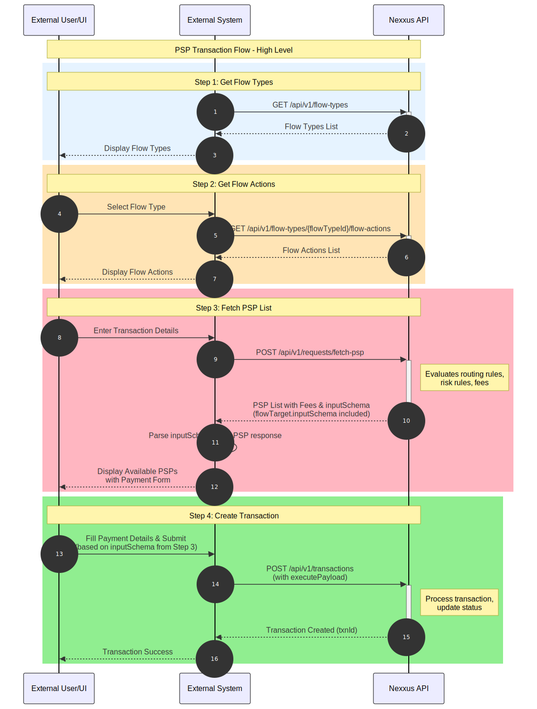

# PSP Transaction Flow

Complete guide for implementing Payment Service Provider (PSP) transaction flows in the Nexxus payment platform.

## Overview

This guide provides detailed instructions for implementing the Payment Service Provider (PSP) transaction flow in the Nexxus payment platform. The flow enables external systems to:

1. Discover available flow types and their associated actions
2. Fetch available PSPs based on transaction criteria (includes flow target details and input schema)
3. Create and process transactions through the selected PSP

## Prerequisites

### Required Information

- **Base URL**: Your Nexxus API endpoint (e.g., `https://api.nexxus.com`)
- **API Version**: `/api/v1`
- **Authentication Token**: JWT access token with appropriate scopes
- **Brand ID**: Unique identifier for your brand
- **Environment ID**: Unique identifier for your environment (e.g., `env_uat_001`, `env_prod_001`)

### Required Headers

All API requests must include:

```
Authorization: Bearer <your_jwt_token>
Content-Type: application/json
```

For APIs that require brand/environment context:

```
X-BRAND-ID: <your_brand_id>
X-ENV-ID: <your_environment_id>
```

## Flow Diagram



**High-Level Flow Overview**

The diagram above illustrates the complete PSP transaction flow from the user's perspective, showing how external systems interact with the Nexxus API to process payments. The flow includes:

1. **Get Flow Types** - Discover available payment flow types
2. **Get Flow Actions** - Retrieve actions for the selected flow type
3. **Fetch PSP List** - Get available payment providers with fees and input schema
4. **Create Transaction** - Submit the payment transaction

For a detailed view of the API interactions, see the [Low-Level Flow Diagram](./api-reference.md#low-level-flow-diagram) in the API Reference.

## Quick Navigation

- [Quick Start Guide](./quick-start.md) - Get started with PSP transactions
- [API Reference](./api-reference.md) - Complete API endpoint documentation
- [Error Handling](./error-handling.md) - Common errors and solutions
- [Best Practices](./best-practices.md) - Recommended implementation patterns

